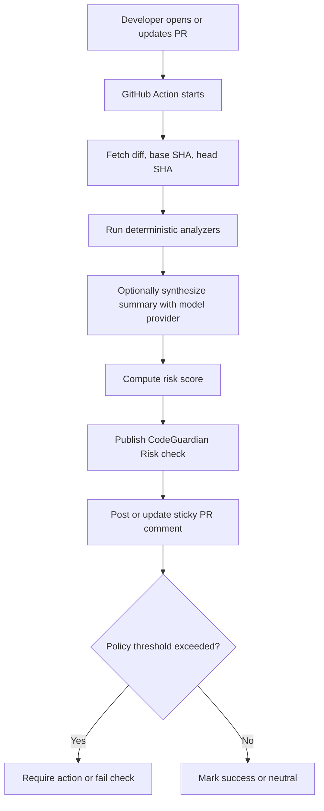
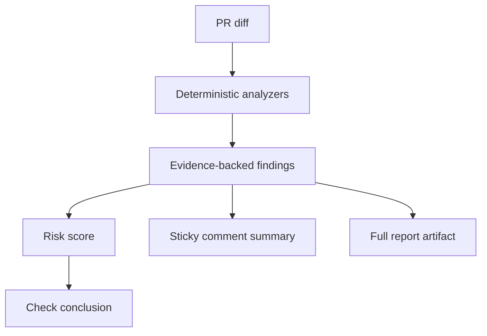

# CodeGuardian AI

**Know what breaks before you merge.**

CodeGuardian AI is a **GitHub-Action-native pre-merge risk checker**. It runs on
pull requests, analyzes what changed, and publishes the result directly on the
GitHub PR merge page.

The product is intentionally centered on two surfaces only:

- the `CodeGuardian Risk` check near the merge box
- one sticky PR summary comment for concise explanation

Every pull request should answer:

- What could this change break?
- Which services, APIs, files, and tests are affected?
- Is this safe to merge?
- What should the developer do next?

This repository contains the working product and the docs for that GitHub-first
experience. The MVP implementation (phases 0–6) is complete: a GitHub Action
that runs deterministic PR risk analysis orchestrated by LangGraph, with zero
model keys required.

## Quick Start

Add CodeGuardian to a repo's PRs (full guide: [INSTALL.md](INSTALL.md)):

```yaml
# .github/workflows/codeguardian.yml
name: CodeGuardian Risk
on:
  pull_request:
    types: [opened, reopened, synchronize, ready_for_review]
  issue_comment:
    types: [created]
permissions:
  contents: write
  pull-requests: write
  checks: write
  issues: write
  actions: read
jobs:
  risk:
    runs-on: ubuntu-latest
    steps:
      - uses: actions/checkout@v4
        with: { fetch-depth: 0 }
      - uses: your-org/CodeGuardian@v0
        with:
          groq-api-key: ${{ secrets.GROQ_API_KEY }}
          hf-token: ${{ secrets.HF_TOKEN }}
```

Provider fallback is **Groq -> Hugging Face -> deterministic**. With no keys,
the deterministic path still produces the score and recommendations; the model
only rephrases the summary and must never invent findings.

## Product

CodeGuardian focuses on one job: help the developer decide whether a pull
request is safe to merge.

It should feel less like a generic AI reviewer and more like a staff engineer
quietly answering the questions that matter:

- Does this violate an architecture boundary?
- Could this API change break consumers?
- Did this migration remove or alter data unsafely?
- Which tests actually matter for this PR?
- Has a similar change caused an incident before?
- Should this merge be blocked, warned, or allowed?

## PR Merge-Page Workflow



The merge decision should be understandable without leaving GitHub:

- `CodeGuardian Risk` tells the developer whether the PR looks safe to merge.
- The sticky comment answers why, with concise findings and next actions.
- The artifact contains the full evidence when someone needs depth.
- Optional `@codeguardian` commands keep follow-up inside the PR thread.

## How It Works

CodeGuardian builds its result from deterministic evidence first, then uses a
model only to summarize and explain. The Action must still work with no model
keys at all.



Today the Action is strongest on JS / TS / Node / React / Next repositories and
focuses on:

- dependency blast radius
- API contract risk
- database and migration risk
- architecture boundary violations
- missing or mismatched test coverage
- historical similarity from GitHub-native memory

## Scope Today

In scope:

- GitHub Action workflow install
- `CodeGuardian Risk` check
- one sticky PR summary comment
- `@codeguardian` PR commands
- deterministic-first analysis with optional model summarization
- GitHub-native memory via artifacts and branch-backed storage

Out of scope:

- hosted dashboard
- billing
- separate web app
- team analytics UI
- SaaS control plane

## Docs

- [INSTALL.md](INSTALL.md) — install and configure the Action
- [SECURITY.md](SECURITY.md) — security policy, vulnerability reporting, hardening
- [THREAT-MODEL.md](THREAT-MODEL.md) — threats, mitigations, and residual risks
- [TROUBLESHOOTING.md](TROUBLESHOOTING.md) — common setup and runtime issues
- [doc/GitHub-PR-User-Flowmap.md](doc/GitHub-PR-User-Flowmap.md) — merge-page product behavior
- [doc/build/README.md](doc/build/README.md) — active production roadmap to v1.0
- [doc/Workflow-Improvements.md](doc/Workflow-Improvements.md) — workflow and report refinements
- [doc/CodeGuardian-AI-Blueprint.md](doc/CodeGuardian-AI-Blueprint.md) — deferred long-term blueprint, not the current product surface

## Current Status

- MVP delivered
- next phase: real-PR validation and E2E hardening
- target outcome: a trusted `v1` GitHub Action focused on the PR merge page
