# CodeGuardian AI

**Know what breaks before you merge.**

CodeGuardian AI is a production-grade SaaS concept for pre-merge engineering intelligence. It integrates directly with GitHub, analyzes pull requests before merge, and predicts downstream consequences across code, dependencies, APIs, databases, tests, architecture boundaries, and historical engineering memory.

The product goal is simple: every pull request should answer:

- What could this change break?
- Which services, APIs, files, and tests are affected?
- Is this safe to merge?
- What should the developer do next?

This repository contains the startup-level product and technical blueprint for CodeGuardian AI **plus the complete MVP implementation (Phases 0–6)** — a GitHub Action that runs deterministic PR risk analysis orchestrated by LangGraph, with zero model keys required. The complete detailed blueprint is available in [doc/CodeGuardian-AI-Blueprint.md](doc/CodeGuardian-AI-Blueprint.md).

## Quick start

Add CodeGuardian to a repo's PRs (full guide: **[INSTALL.md](INSTALL.md)**):

```yaml
# .github/workflows/codeguardian.yml
name: CodeGuardian Risk
on:
  pull_request:
    types: [opened, reopened, synchronize, ready_for_review]
  issue_comment:
    types: [created]
permissions:
  contents: write       # write only for the codeguardian-memory branch
  pull-requests: write
  checks: write
  issues: write
  actions: read
jobs:
  risk:
    runs-on: ubuntu-latest
    steps:
      - uses: actions/checkout@v4
        with: { fetch-depth: 0 }
      - uses: your-org/CodeGuardian@v0
        with:
          groq-api-key: ${{ secrets.GROQ_API_KEY }}  # optional
          hf-token: ${{ secrets.HF_TOKEN }}          # optional
```

Setup, configuration reference, and the advisory→guarded→strict rollout are in
**[INSTALL.md](INSTALL.md)**; see also **[TROUBLESHOOTING.md](TROUBLESHOOTING.md)**
and **[CHANGELOG.md](CHANGELOG.md)**.

Provider fallback is **Groq → Hugging Face → deterministic**; with no keys the
deterministic path still produces the full score and recommendations (the LLM
only rephrases the summary, never invents findings). Develop locally with
`python -m venv .venv && .venv/bin/pip install -e ".[dev]" && .venv/bin/pytest`.
See [doc/build/archive/phase-0-product-contract.md](doc/build/archive/phase-0-product-contract.md)
for the product contract and source layout under `src/codeguardian/`. The active
roadmap to v1.0 is [doc/build/README.md](doc/build/README.md).

## Documentation

- [Product and Engineering Blueprint](doc/CodeGuardian-AI-Blueprint.md)
- [GitHub PR User Flowmap](doc/GitHub-PR-User-Flowmap.md)
- [Phase-Wise Build Plan](doc/Phase-Wise-Build-Plan.md)
- [Detailed Build Phases](doc/build/README.md)
- [Workflow Improvements](doc/Workflow-Improvements.md)

## Product Vision

Modern AI coding tools help developers generate code, but they rarely understand the downstream consequences of a change. CodeGuardian AI is designed to become the GitHub-native intelligence layer that understands repository structure, historical breakages, dependency flow, API contracts, database migrations, and test impact before a pull request is merged.

CodeGuardian AI should feel less like a generic AI reviewer and more like a staff engineer quietly answering the questions that matter:

- Does this violate an architecture boundary?
- Could this API change break consumers?
- Did this migration remove or alter data unsafely?
- Which tests actually matter for this PR?
- Has a similar change caused an incident before?
- Should this merge be blocked, warned, or allowed?

## Core Pull Request Output

Example PR report:

```text
Risk Score: 8.2 / 10

Affected Services:
- Auth
- Billing
- User Profile

Potential Breakages:
- API contract mismatch
- Database migration risk
- Missing integration coverage

Recommended Actions:
- Run auth integration suite
- Review migration rollback path
- Add profile API regression test
```

## High-Level Workflow

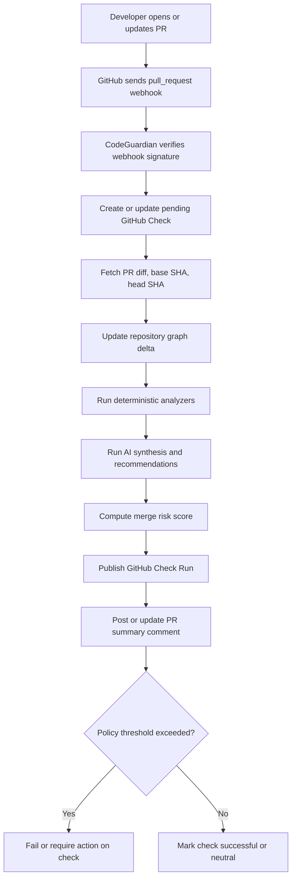

## System Architecture

CodeGuardian should start as a modular monolith with separate worker processes. This keeps the early team fast while preserving clean boundaries for future scale.

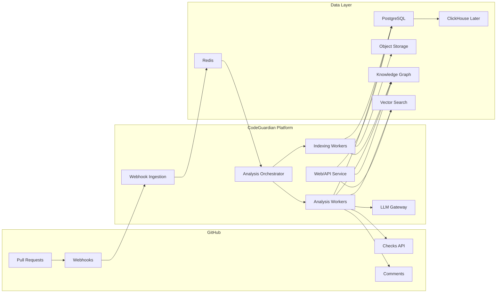

## GitHub Integration

CodeGuardian must be a GitHub-native product. The primary integration should be a GitHub App, with GitHub OAuth used for dashboard login and user identity linking.

### GitHub Capabilities

- Install as a GitHub App.
- Select repositories during installation.
- Subscribe to pull request and push webhooks.
- Create GitHub Check Runs.
- Add pull request comments.
- Add review annotations for high-confidence localized issues.
- Optionally block merges through required checks.
- Support GitHub Marketplace distribution.
- Add GitHub Enterprise Cloud and GitHub Enterprise Server support over time.

### GitHub App Event Flow

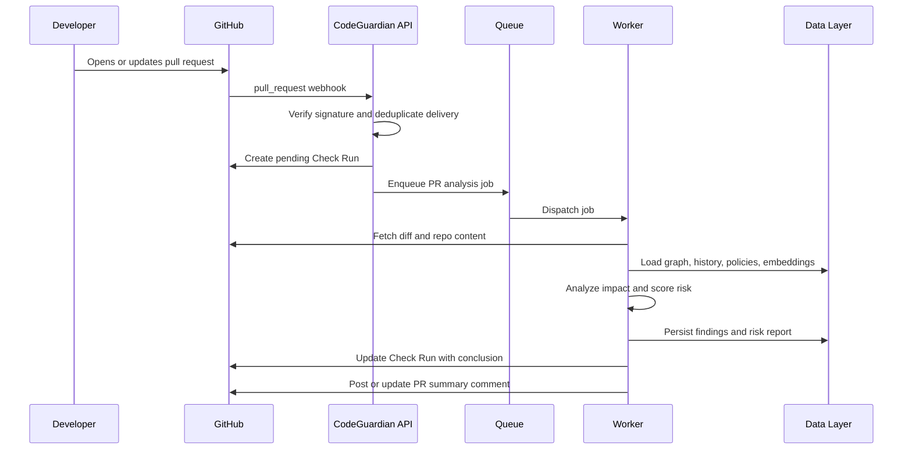

## AI Architecture

The AI system should be multi-agent, but deterministic tools should produce the evidence. LLMs should synthesize, rank, explain, and recommend. This keeps the product trustworthy and reduces hallucination risk.

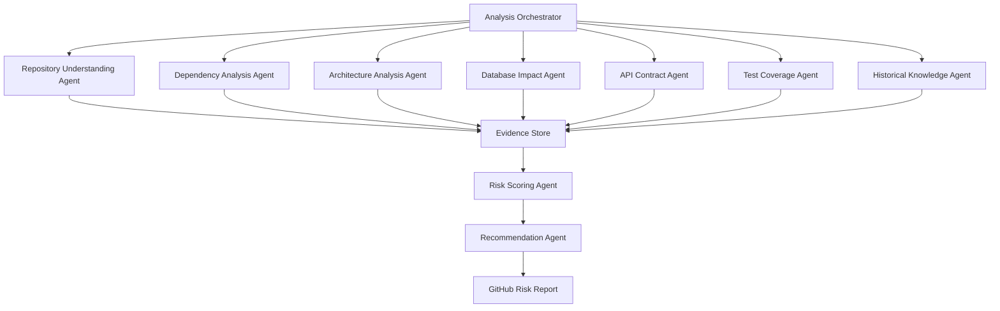

### Agent Responsibilities

| Agent | Responsibility | Key Output |
| --- | --- | --- |
| Repository Understanding Agent | Builds service, file, module, route, and ownership context | Repository map |
| Dependency Analysis Agent | Finds impacted imports, exports, packages, and dependents | Impact graph |
| Architecture Analysis Agent | Detects layer, boundary, circular dependency, and coupling violations | Architecture findings |
| Database Impact Agent | Analyzes Prisma, SQL, PostgreSQL, MySQL, MongoDB, migrations, and schema drift | DB risk findings |
| API Contract Agent | Checks REST, OpenAPI, GraphQL, route handlers, and clients | API breakage findings |
| Test Coverage Agent | Predicts affected tests and missing coverage | Test recommendations |
| Historical Knowledge Agent | Retrieves similar PRs, incidents, ADRs, and past failures | Historical context |
| Risk Scoring Agent | Combines evidence into calibrated risk score | Risk score |
| Recommendation Agent | Converts evidence into concise developer action | PR report |

## Repository Knowledge Graph

The knowledge graph is the core technical moat. It represents how files, services, functions, APIs, database schemas, tests, and historical changes relate to each other.

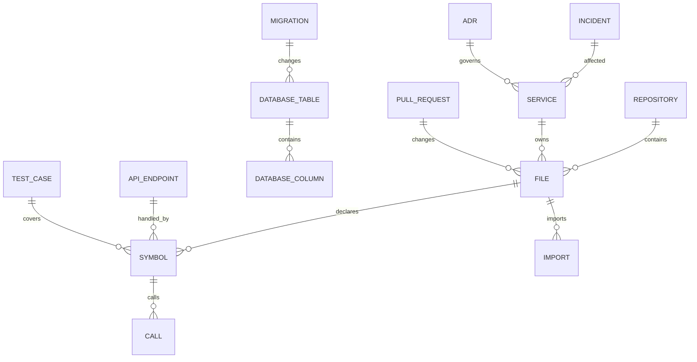

### Graph Nodes

- Repository
- Commit
- Pull Request
- File
- Directory
- Package
- Module
- Class
- Function
- React Component
- API Endpoint
- Database Schema
- Table
- Column
- Migration
- Test File
- Test Case
- Service
- Owner
- Architecture Layer
- ADR
- Incident

### Graph Edges

- `CONTAINS`
- `DECLARES`
- `IMPORTS`
- `EXPORTS`
- `CALLS`
- `REFERENCES`
- `HANDLES_ROUTE`
- `READS_TABLE`
- `WRITES_TABLE`
- `MIGRATES`
- `TESTS`
- `COVERS`
- `DEPENDS_ON`
- `OWNED_BY`
- `BELONGS_TO_LAYER`
- `VIOLATES`
- `CHANGED_IN`
- `BROKE_IN_PAST`

## Data Architecture

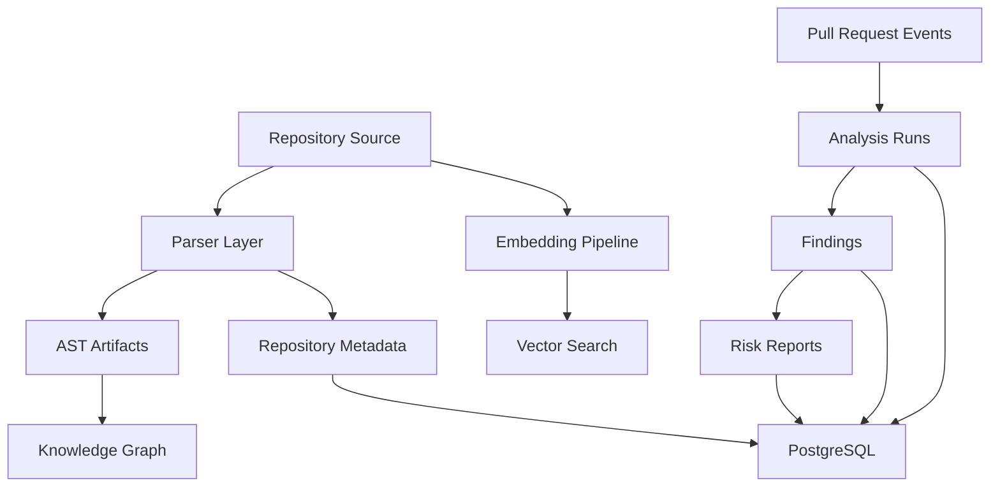

### Recommended Storage

| Need | Recommended Store | Why |
| --- | --- | --- |
| Tenants, users, repos, runs, findings | PostgreSQL | Durable source of truth |
| Short-lived locks, rate limits, cache | Redis | Fast operational cache |
| Raw snapshots and parser artifacts | Object storage | Cheap large object storage |
| Initial graph model | PostgreSQL adjacency tables | Simpler MVP operations |
| Advanced graph traversal | Neo4j later | Better graph-native queries |
| Semantic memory | pgvector first | Simple hybrid search |
| Analytics and event history | ClickHouse later | Efficient high-volume analytics |

## Pull Request Analysis Pipeline

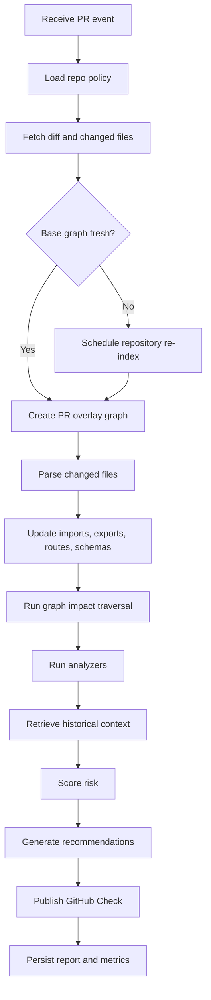

## Risk Scoring Model

Risk should be explainable and category-based.

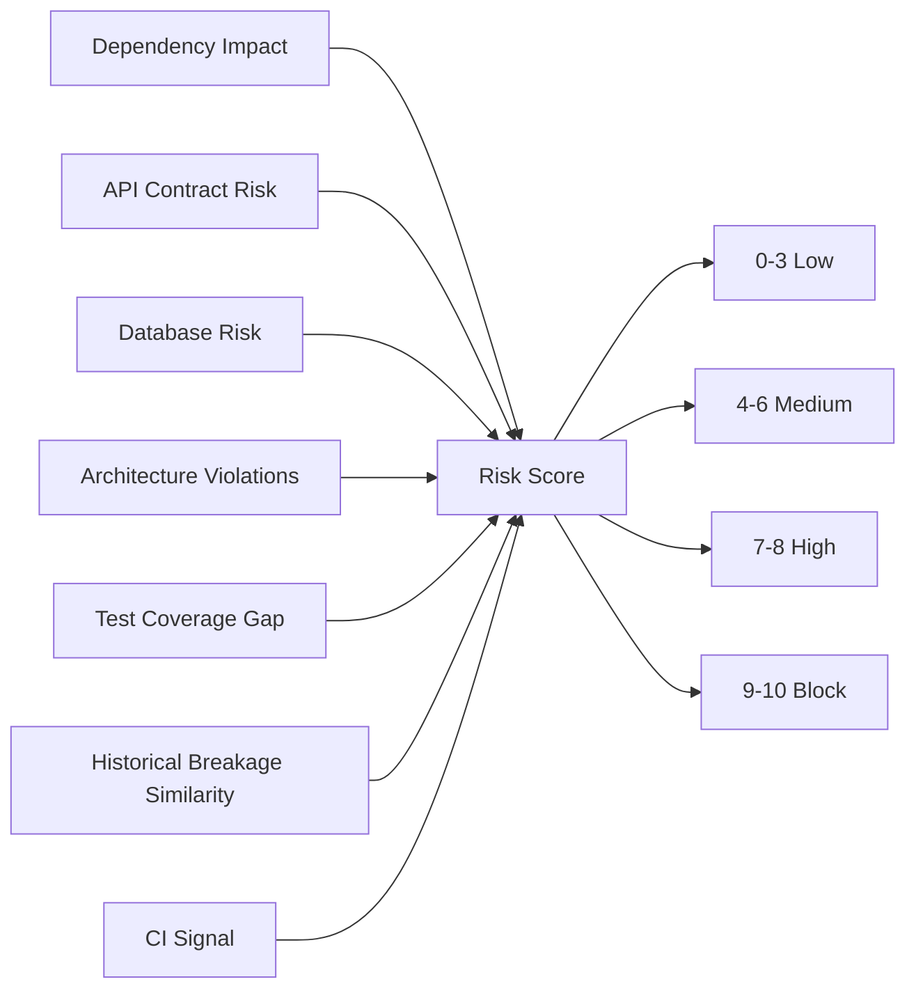

Example scoring inputs:

- Number and criticality of affected services.
- Depth of transitive dependency impact.
- Public API changes.
- Destructive migration operations.
- Missing or stale tests.
- Architecture rule violations.
- Similar historical failures.
- Confidence of each analyzer.

## Database Analysis Subsystem

CodeGuardian should understand Prisma, PostgreSQL, MySQL, and MongoDB. The database analyzer should detect dangerous or incomplete schema changes.

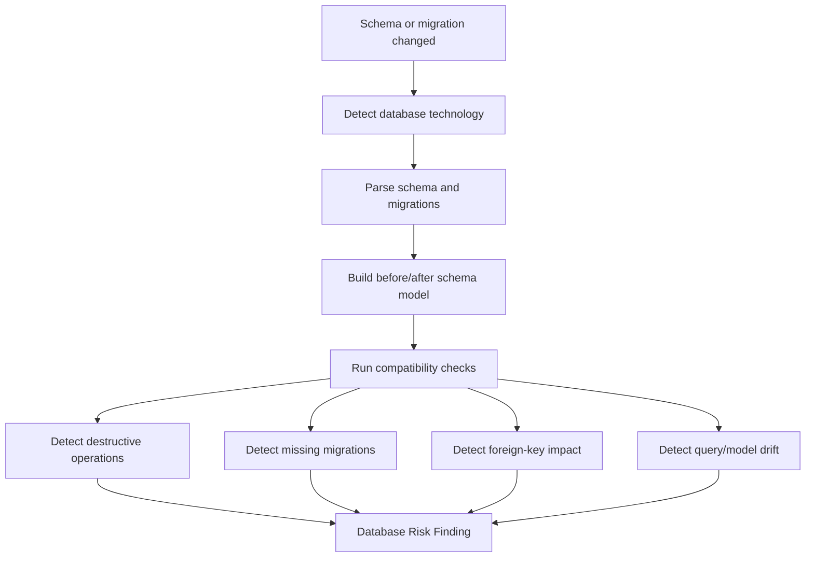

## Test Impact Analysis

The test impact system predicts which tests should run and where coverage is missing.

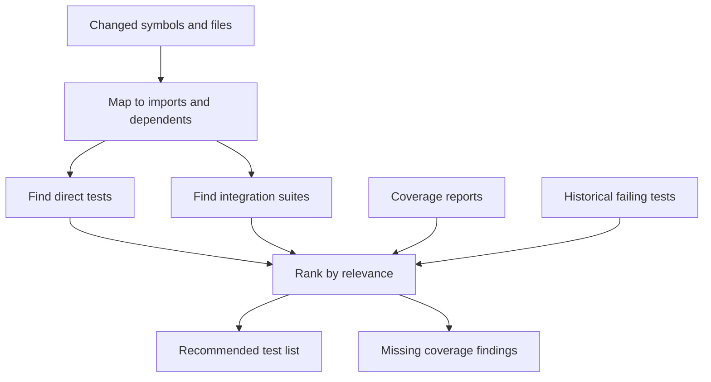

Heuristics:

- File naming conventions such as `user.service.ts` to `user.service.test.ts`.
- Import graph from changed symbols to test files.
- Coverage maps from CI.
- Historical co-change and co-failure patterns.
- Service ownership and route-level test suites.

## Architecture Rule Engine

The architecture engine enforces repository-specific boundaries.

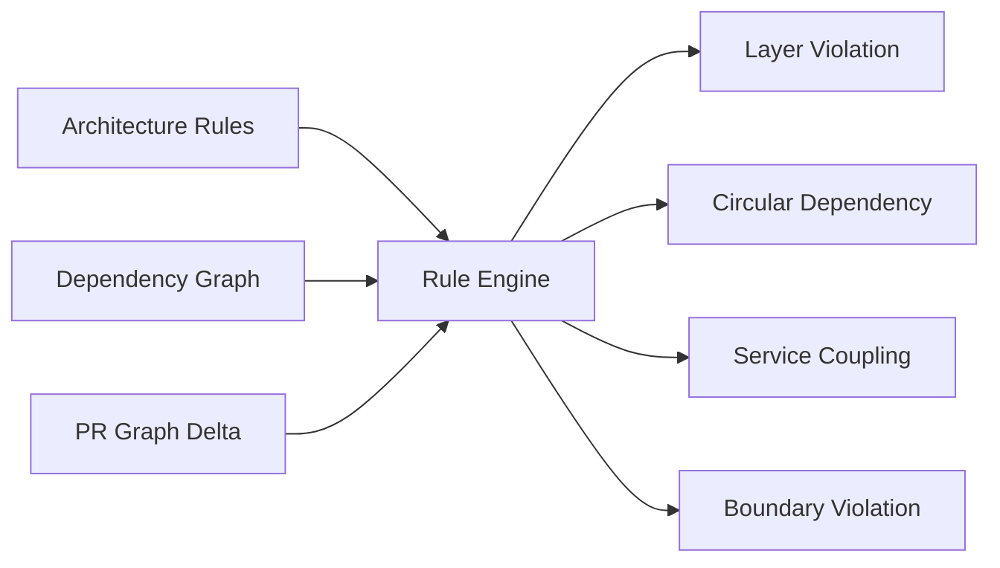

Example rules:

- UI cannot import infrastructure modules.
- Domain modules cannot import presentation modules.
- Billing service cannot depend directly on user profile internals.
- API package cannot import test helpers.
- Shared package additions require owner review.

## Memory System

The memory system gives CodeGuardian long-term engineering context.

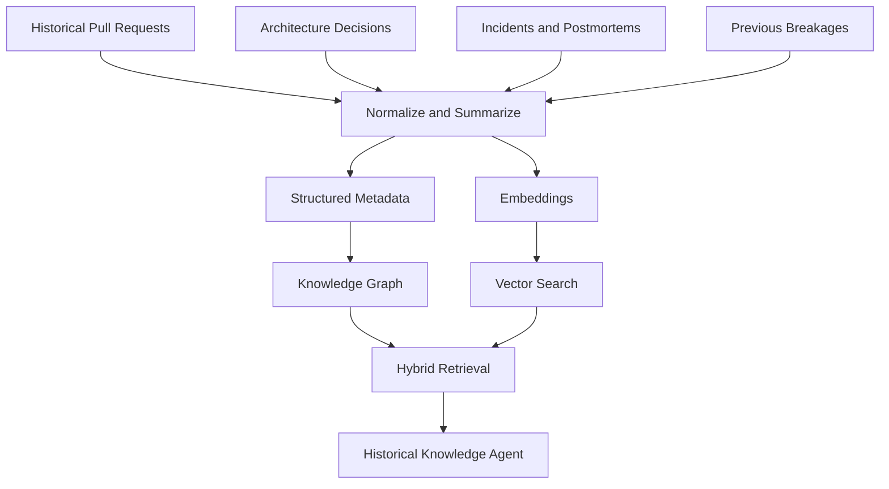

Memory should store:

- Prior PRs and risk reports.
- Merge outcomes.
- CI failures.
- Incident reports.
- ADRs.
- Postmortems.
- Previous breakage patterns.
- Developer feedback on false positives and false negatives.

## Language Roadmap

| Phase | Languages and Frameworks | Analysis Focus |
| --- | --- | --- |
| Phase 1 | JavaScript, TypeScript, Node.js, React, Next.js | Imports, routes, components, API handlers, tests, Prisma |
| Phase 2 | Python, FastAPI, Django | Routes, services, migrations, pytest, dependency impact |
| Phase 3 | Java, Spring Boot, Go | Service boundaries, controllers, packages, integration tests |

Parser strategy:

- Use Tree-sitter for broad, incremental parsing.
- Use TypeScript compiler API for TypeScript-specific semantic analysis.
- Add framework-specific analyzers for Next.js, React, Prisma, FastAPI, Django, Spring, and Go modules.
- Keep parser outputs normalized into a shared intermediate representation.

## SaaS Product Surface

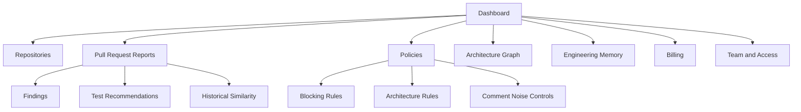

## Recommended Tech Stack

| Layer | Recommendation |
| --- | --- |
| Frontend | Next.js, TypeScript |
| Backend | TypeScript with Fastify or NestJS |
| Workers | TypeScript workers, optional Python analysis workers |
| Database | PostgreSQL |
| Cache | Redis |
| Queue | SQS or managed queue first, Kafka later |
| Graph | PostgreSQL adjacency tables first, Neo4j later |
| Vector Search | pgvector first, dedicated vector DB later if needed |
| Parser | Tree-sitter, TypeScript compiler API, framework analyzers |
| AI Orchestration | Typed workflow first, LangGraph later |
| LLM Layer | Provider-abstracted LLM gateway |
| Storage | S3-compatible object storage |
| Observability | OpenTelemetry, structured logs, traces, metrics |
| Auth | GitHub OAuth, later SAML and SCIM |
| Deployment | Managed containers, managed PostgreSQL, managed Redis |

## Scalability Plan

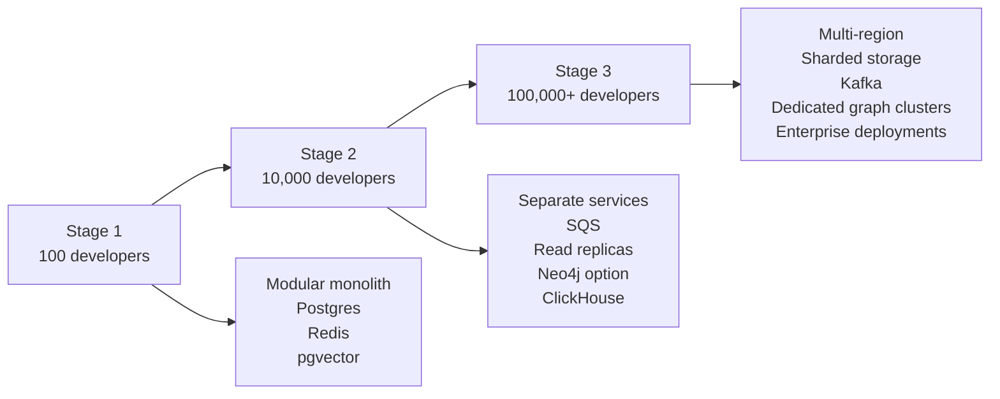

### Stage 1

- Modular monolith.
- PostgreSQL as source of truth.
- Redis cache and queue.
- pgvector for semantic retrieval.
- Object storage for snapshots.

### Stage 2

- Dedicated webhook, indexing, analysis, API, and LLM gateway services.
- SQS or equivalent managed durable queues.
- Read replicas and heavier caching.
- Neo4j for large graph workloads.
- ClickHouse for analytics.

### Stage 3

- Multi-region ingress.
- Sharded analysis storage.
- Dedicated enterprise graph clusters.
- Kafka for event streaming and replay.
- Data residency and self-hosted options.

## Security Model

Security principles:

- Least-privilege GitHub permissions.
- Verify all webhook signatures.
- Use short-lived GitHub installation tokens.
- Encrypt credentials and private keys with KMS.
- Redact secrets before model calls.
- Treat repository content as untrusted prompt input.
- Keep tenant data isolated.
- Provide audit logs for enterprise customers.
- Offer configurable data retention.

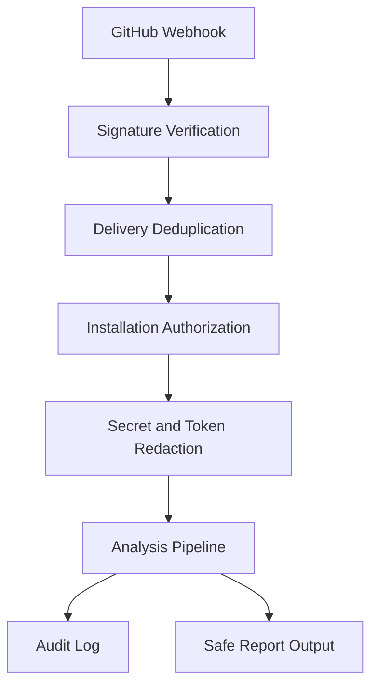

## Roadmap

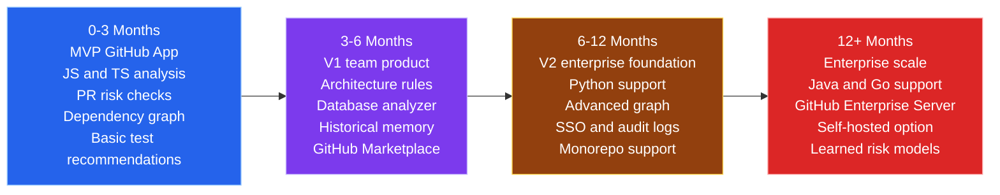

## MVP Scope

MVP should include:

- GitHub App installation.
- Pull request webhook processing.
- GitHub Check Run output.
- Sticky PR summary comment.
- JavaScript and TypeScript support.
- Node.js, React, and Next.js conventions.
- Import/dependency graph.
- Basic test recommendation engine.
- Basic architecture rule checks.
- Basic Prisma migration risk detection.
- Repository and policy dashboard.

MVP should not include:

- Full enterprise deployment.
- Full Neo4j production dependency.
- Java, Go, and Python support.
- Autonomous code modification.
- Complete ML-based risk prediction.

## Monetization

| Plan | Target User | Pricing Direction |
| --- | --- | --- |
| Free | Open source and trial users | Limited public/private PR analyses |
| Pro | Individual developers | Monthly per-user pricing |
| Team | Startups and growing teams | Per-seat plus usage-based limits |
| Enterprise | Large engineering organizations | Annual contracts, SSO, audit, enterprise GitHub |

Why teams pay:

- Fewer broken merges.
- Better test selection.
- Faster review cycles.
- Lower CI waste.
- Architecture enforcement.
- Better onboarding into unfamiliar codebases.
- Historical knowledge that survives team churn.

## Competitive Positioning

| Product | Focus | CodeGuardian Differentiation |
| --- | --- | --- |
| GitHub Copilot | Code generation and coding assistance | Consequence prediction before merge |
| CodeRabbit | AI code review | Dependency, architecture, database, test, and historical risk |
| Graphite | Stacked PR workflow | Merge risk intelligence and policy |
| Snyk | Security and dependency vulnerabilities | Engineering breakage risk |
| SonarQube | Code quality and static rules | Change impact and contextual merge risk |

## Repository Contents

```text
.
├── README.md
└── doc
    ├── CodeGuardian-AI-Blueprint.md
    ├── GitHub-PR-User-Flowmap.md
    ├── Phase-Wise-Build-Plan.md
    ├── Workflow-Improvements.md
    └── build
        ├── README.md
        ├── phase-0-product-foundation.md
        ├── phase-1-github-actions-pr-checker.md
        ├── phase-2-langgraph-agentic-ai.md
        ├── phase-3-pr-conversation-loop.md
        ├── phase-4-advanced-analyzers.md
        ├── phase-5-memory-and-history.md
        └── phase-6-packaging-and-adoption.md
```

## Current Status

**Phase 0 (product contract) and Phase 1 (GitHub Actions PR checker MVP) are
implemented.** The implementation stack is **Python + LangGraph** (a committed
decision that overrides the doc's TypeScript recommendation). Source lives under
`src/codeguardian/`; tests under `tests/`; the Action is `action.yml`.

Recommended next steps:

1. Phase 2 — fan the linear LangGraph into per-domain agents (API/DB/architecture).
2. Phase 3 — the `@codeguardian` PR conversation loop on comment events.
3. Add decision records for major architecture choices.
4. Convert the MVP section into GitHub issues or a project roadmap.
