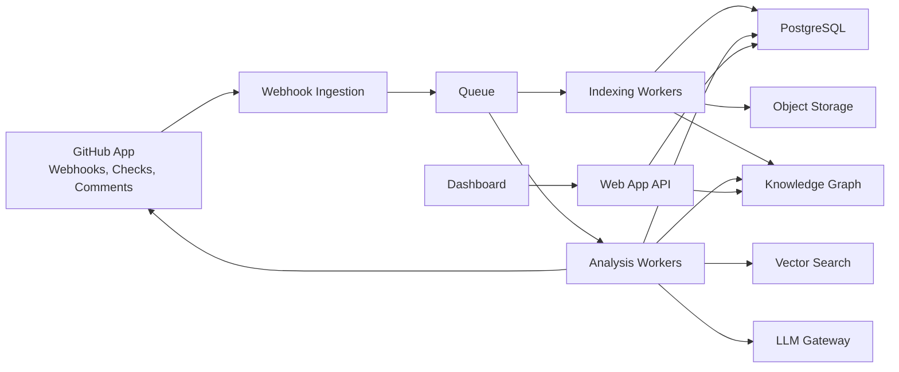
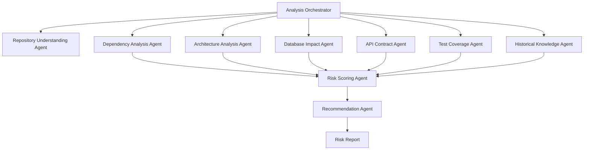
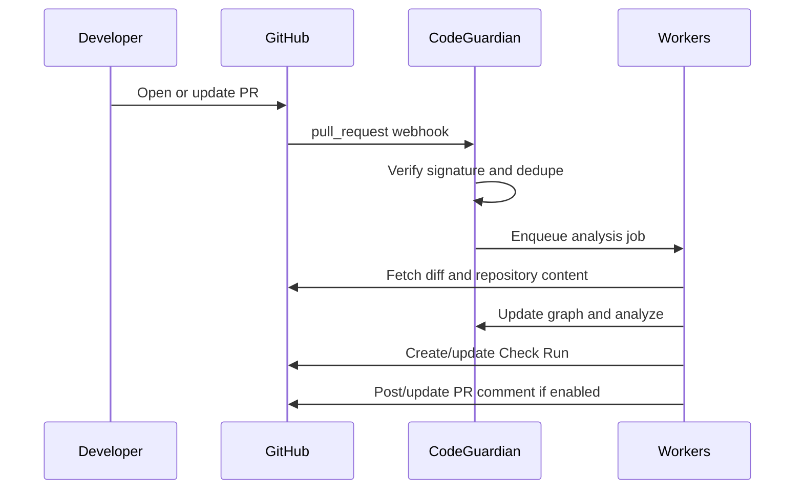

# CodeGuardian AI: Product and Engineering Blueprint

Tagline: "Know what breaks before you merge."

## 1. Executive Summary

CodeGuardian AI is a pre-merge engineering intelligence platform for GitHub-native teams. It analyzes pull requests before merge and predicts downstream consequences: impacted files, affected services, API contract risk, database migration risk, architecture violations, test impact, and an overall merge risk score.

The wedge is simple: every pull request receives a clear risk report inside GitHub. The long-term platform is larger: a continuously updated repository knowledge graph, historical engineering memory, and an agentic analysis layer that becomes the system of record for engineering consequences.

Primary recommendation: launch as a GitHub App backed by a modular TypeScript backend, PostgreSQL, Redis, object storage, queue-based workers, Tree-sitter parsing, a repository knowledge graph, hybrid search, and a deterministic-first AI pipeline. Start with JavaScript, TypeScript, Node.js, React, and Next.js. Use LLM agents for synthesis and recommendations, but keep static analysis, graph traversal, and scoring explainable.

Core principle: CodeGuardian should not behave like a generic code reviewer. It should answer, "What can this change break, how confident are we, and what should the developer do before merge?"

Key external platform facts used in this design:

- GitHub Apps are the correct integration primitive for pull request automation, repository access, checks, and webhooks: <https://docs.github.com/en/apps>
- GitHub Check Runs require GitHub App `checks:write`; OAuth apps cannot create check runs: <https://docs.github.com/rest/checks/runs>
- GitHub webhooks provide real-time pull request, push, check, and installation events: <https://docs.github.com/en/webhooks/webhook-events-and-payloads>
- Tree-sitter is an incremental parsing library suitable for multi-language source parsing: <https://tree-sitter.github.io/>
- LangGraph models agent workflows as stateful graphs and is appropriate for orchestrating multi-agent analysis: <https://docs.langchain.com/oss/python/langgraph/graph-api>
- Neo4j supports graph workloads and vector indexes, but should be introduced when graph queries exceed PostgreSQL's practical comfort zone: <https://neo4j.com/docs/> and <https://neo4j.com/docs/cypher-manual/current/indexes/semantic-indexes/vector-indexes/>

## 2. Product Requirements Document

### Product Goals

- Predict merge risk before code lands.
- Make risk visible where developers already work: pull requests, checks, comments, and branch protection.
- Recommend the smallest useful action: run specific tests, review a migration, validate an API, add coverage, or involve an owner.
- Build durable engineering memory from code, pull requests, incidents, architecture decisions, and historical failures.
- Support small teams first, then expand into enterprise controls, compliance, monorepos, and multi-service intelligence.

### Non-Goals for MVP

- Fully autonomous code modification.
- Replacing CI, SAST, SCA, or human review.
- Perfect whole-program semantic analysis for every language.
- Runtime production observability ingestion before the product has strong pre-merge value.

### Users

- Individual developers: want fast, actionable PR feedback.
- Maintainers: want confidence accepting external contributions.
- Startup teams: want fewer broken merges without heavyweight process.
- Staff engineers and platform teams: want architecture boundaries enforced.
- Enterprise organizations: want policy, auditability, monorepo support, and GitHub Enterprise support.

### Core User Journey

1. User installs CodeGuardian GitHub App.
2. User selects repositories and chooses default policy.
3. A pull request is opened or synchronized.
4. CodeGuardian indexes the diff, retrieves repository context, analyzes impact, and posts a GitHub Check.
5. If enabled, CodeGuardian posts a concise PR comment with risk score, affected services, likely breakages, and recommended actions.
6. If risk exceeds policy threshold, CodeGuardian marks the check as failed or neutral depending on configuration.
7. Developers click through to the dashboard for graph evidence, test recommendations, and historical context.

### Functional Requirements

- GitHub App installation for user and organization accounts.
- Pull request analysis on `opened`, `reopened`, `synchronize`, and `ready_for_review`.
- Commit and push event handling for incremental indexing.
- Risk report generation with score, categories, evidence, confidence, and recommended actions.
- GitHub Check Run creation and update.
- Optional PR review comments for specific risky lines.
- Optional summary comment with idempotent updates.
- Repository indexing for files, imports, exports, functions, classes, routes, schemas, tests, and package dependencies.
- Dependency graph and service map.
- Architecture rule engine.
- Database schema and migration analyzer.
- Test impact analyzer.
- Dashboard for repositories, pull requests, risk trends, settings, and policy.
- User/team/org settings.
- Usage metering and billing.

### Non-Functional Requirements

- First PR feedback within 60 seconds for small repositories.
- Incremental PR analysis under 3 minutes for medium repositories.
- Large monorepo analysis via asynchronous partial results and progressive check updates.
- At-least-once webhook processing with idempotency.
- Tenant isolation and least-privilege GitHub permissions.
- Explainable output: every high-risk finding should cite files, graph edges, historical examples, or static rules.
- Secure handling of source code, secrets, and model prompts.

## 3. System Architecture

### Recommended Architecture

Start with a modular monolith plus workers. This gives a small team deployment simplicity while preserving clear boundaries for future extraction.

### Service Boundaries

- Web/API service: dashboard, settings, billing, auth, GitHub OAuth callbacks, installation management.
- Webhook service: validates signatures, stores payloads, deduplicates deliveries, enqueues work.
- Indexing workers: clone/fetch repository snapshots, parse files, update graph and embeddings.
- Analysis workers: run static analysis, graph traversals, AI agents, risk scoring, and GitHub updates.
- LLM gateway: provider abstraction, prompt logging, redaction, caching, rate limiting, cost accounting.
- Billing service module: plans, usage, seats, invoices, marketplace billing.

### Why Modular Monolith First

Chosen because the product is analysis-heavy, iteration speed matters, and premature microservices would slow learning. Use module boundaries, queues, typed APIs, and separate worker deployments so high-load components can be extracted later.

Alternatives:

- Full microservices: better isolation, worse startup speed.
- Serverless only: good for bursty webhooks, weaker for long repository indexing and graph workloads.
- Single synchronous app: simple, but brittle under webhook spikes.

Future migration path: extract indexing, analysis, LLM gateway, and graph services when queue depth, team ownership, or scaling demands justify it.

## 4. AI Architecture

### Design Philosophy

The AI layer should synthesize, rank, explain, and recommend. It should not be the sole source of truth for dependency resolution, database diffing, architecture rules, or test selection. Deterministic tools produce evidence; agents reason over evidence.

### Multi-Agent System

### Agent Responsibilities

Repository Understanding Agent:

- Inputs: repository metadata, file tree, parser outputs, package manifests, framework conventions.
- Outputs: service map, entrypoints, ownership candidates, route inventory, module boundaries.
- Tools: Tree-sitter, TypeScript compiler API, package manager parsers, framework detectors.

Dependency Analysis Agent:

- Inputs: changed files, import/export graph, dependency manifests, lockfiles.
- Outputs: impacted files, transitive dependents, circular dependency candidates, package risk.
- Tools: graph traversal, dependency resolver, lockfile diff.

Architecture Analysis Agent:

- Inputs: service map, architecture rules, changed edges.
- Outputs: layer violations, service coupling increases, boundary breaches.
- Tools: rule engine, graph queries.

Database Impact Agent:

- Inputs: Prisma schema, SQL migrations, ORM models, migration history, changed queries.
- Outputs: destructive changes, missing migrations, foreign-key impact, backward compatibility risk.
- Tools: schema diff, migration parser, database-specific rule packs.

API Contract Agent:

- Inputs: route definitions, OpenAPI specs, GraphQL schemas, handlers, clients, changed types.
- Outputs: endpoint compatibility risks, client impact, contract drift.
- Tools: OpenAPI diff, GraphQL schema diff, TypeScript type diff.

Test Coverage Agent:

- Inputs: test graph, coverage reports, changed symbols, historical failures.
- Outputs: tests to run, missing coverage, likely failing suites.
- Tools: static test mapping, coverage ingestion, historical co-change model.

Historical Knowledge Agent:

- Inputs: prior PRs, incidents, postmortems, ADRs, previous CodeGuardian findings.
- Outputs: similar past changes, known risky areas, prior mitigation patterns.
- Tools: hybrid retrieval over graph, embeddings, and structured metadata.

Risk Scoring Agent:

- Inputs: all findings, confidence values, repository policy.
- Outputs: numeric risk score, category scores, block/pass/neutral recommendation.
- Tools: calibrated scoring model, rules, optional learned ranker.

Recommendation Agent:

- Inputs: findings, risk score, developer persona, repository policy.
- Outputs: concise PR summary, check annotations, specific actions.
- Tools: LLM synthesis with evidence constraints.

### LangGraph Recommendation

Use LangGraph for orchestration after MVP prototype, not on day one if it slows shipping. It is well-suited because the analysis is naturally a stateful graph with specialized agents, shared state, conditional branches, retries, and resumability.

Chosen path:

- MVP: implement a typed internal workflow engine with explicit steps and persisted job state.
- V1: migrate orchestration to LangGraph if multi-agent complexity grows and observability/debugging benefits outweigh dependency cost.

Tradeoff: LangGraph accelerates agent workflow modeling, but static analysis pipelines need deterministic scheduling, resource controls, and strict evidence schemas. Keep the core domain model independent from LangGraph.

## 5. GitHub Integration Design

### GitHub App Architecture

Use a GitHub App as the primary integration. It supports installations, repository-scoped permissions, webhooks, checks, comments, and organization workflows. A separate OAuth flow connects GitHub user identity to the CodeGuardian dashboard.

### OAuth Flow

- GitHub App installation authorizes repository access.
- OAuth authorizes a user for dashboard login and account linking.
- Store GitHub user ID, org memberships when needed, and installation access mapping.
- Use short-lived GitHub installation tokens generated server-side.

### Installation Flow

1. User clicks "Install GitHub App."
2. GitHub displays repository selection and permissions.
3. GitHub redirects to CodeGuardian setup with installation ID.
4. CodeGuardian verifies installation, creates org/workspace, syncs repositories.
5. User selects policy: advisory, required check, or strict blocking.
6. First background index starts.

### Repository Permissions

Minimum recommended permissions:

- Contents: read, to fetch repository files and diffs.
- Metadata: read, required by GitHub Apps.
- Pull requests: read/write, to inspect PRs and create review comments.
- Checks: read/write, to create check runs.
- Commit statuses: read/write only if supporting legacy status API fallback.
- Issues: write only if PR summary comments require issue comment API.
- Actions: read, for workflow/test metadata.
- Administration: avoid for MVP; enterprise policy setup can document branch protection separately.

### Webhook Design

Subscribe to:

- `installation`, `installation_repositories`: sync installations and repository access.
- `pull_request`: main trigger for analysis.
- `push`: incremental index updates and default branch changes.
- `check_run`, `check_suite`: re-run support and check lifecycle.
- `workflow_run`: ingest CI outcomes for learning.
- `repository`: rename/archive/delete handling.
- `membership` or `organization` events later for enterprise access control.

Webhook requirements:

- Verify `X-Hub-Signature-256`.
- Store delivery ID for idempotency.
- Acknowledge quickly, process asynchronously.
- Use replay-safe event handlers.
- Normalize events into internal `RepositoryEvent`, `PullRequestEvent`, and `CheckEvent` records.

### PR Event Processing

- On PR opened/synchronized: create pending check immediately.
- Fetch diff, changed files, base SHA, head SHA.
- Determine whether repository index exists and whether base index is fresh.
- Run incremental indexing for changed files.
- Run impact analysis against graph.
- Generate risk report.
- Update check with conclusion: success, neutral, action_required, or failure.
- Update sticky PR comment with summary.
- Add line annotations only for high-confidence, localized findings.

### Commit Event Processing

- On push to default branch: update canonical repository graph.
- On push to PR branch: schedule incremental analysis.
- Store commit-level parser outputs and graph deltas.
- Avoid full re-index unless manifest, config, or lockfile changes require wider invalidation.

### Review Comment Automation

Use sparingly. Developers hate noisy bots. Default to one sticky summary comment and Check annotations. Use review comments only when:

- Finding maps to a specific line.
- Confidence is high.
- Action is clear.
- The same comment has not already been posted.

### Check Runs API

Use GitHub Check Runs as the primary status surface because GitHub Apps can create rich checks with summaries, annotations, statuses, and actions. GitHub's docs state Check Runs write access is available to GitHub Apps with `checks:write`.

Check names:

- `CodeGuardian Risk`
- Optional sub-checks later: `CodeGuardian Architecture`, `CodeGuardian Database`, `CodeGuardian Tests`

Conclusions:

- `success`: low risk.
- `neutral`: informational or configured non-blocking.
- `failure`: configured blocking threshold exceeded.
- `action_required`: manual review needed.

### GitHub Actions Integration

Offer an optional Action for teams that want in-CI execution:

- Upload coverage reports, test manifests, build graph artifacts, OpenAPI specs.
- Trigger deeper analysis from CI.
- Run in self-hosted enterprise environments where source egress is restricted.
- Emit artifacts consumed by CodeGuardian API.

Do not require Actions for MVP. The GitHub App must work standalone.

### Marketplace Distribution

List as a GitHub Marketplace App with free and paid tiers. Marketplace reduces friction and supports plan-based discovery. GitHub Marketplace supports free and paid app listings according to GitHub's Marketplace documentation.

### Enterprise GitHub Support

- Support GitHub Enterprise Cloud in V1.
- Support GitHub Enterprise Server in V2 with customer-managed deployment or private connectivity.
- Requirements: configurable API base URLs, webhook URL allowlisting, private network ingress, customer-managed keys, SSO/SAML, SCIM, audit logs.

## 6. Database Design

### Primary PostgreSQL Schema

PostgreSQL is the system of record for tenants, installations, repositories, jobs, findings, billing, policies, and metadata.

Core tables:

- `workspaces`: tenant account.
- `users`: CodeGuardian users.
- `workspace_members`: roles and membership.
- `github_installations`: installation ID, account type, permissions, token metadata.
- `repositories`: GitHub repo ID, owner, name, default branch, visibility, installation.
- `pull_requests`: repo, number, base/head SHA, state, author.
- `analysis_runs`: PR/commit analysis execution, status, timings, model cost, version.
- `findings`: normalized risk findings with category, severity, confidence, evidence.
- `risk_reports`: aggregate score, summary, recommendations, rendered markdown.
- `policies`: blocking thresholds, enabled analyzers, rule packs.
- `architecture_rules`: workspace or repo-level custom rules.
- `jobs`: durable job state if not fully externalized to queue.
- `billing_accounts`, `subscriptions`, `usage_events`.
- `audit_events`: security and admin history.

Why PostgreSQL:

- Reliable transactional core.
- Strong JSONB support for evolving analysis payloads.
- Easy startup operations.
- Works well with row-level tenant isolation.

Alternatives:

- DynamoDB: excellent scale, poorer relational ergonomics for startup iteration.
- MySQL: viable, but PostgreSQL has stronger JSON, indexing, and extension ecosystem.

Future migration: move high-volume events and analytics to ClickHouse; keep PostgreSQL as source of truth.

## 7. Knowledge Graph Design

### Graph Entities

Nodes:

- `Repository`
- `Commit`
- `File`
- `Directory`
- `Package`
- `Module`
- `Class`
- `Function`
- `Method`
- `Component`
- `Route`
- `ApiEndpoint`
- `GraphQLType`
- `DatabaseSchema`
- `Table`
- `Column`
- `Migration`
- `TestFile`
- `TestCase`
- `Service`
- `Owner`
- `ArchitectureLayer`
- `PullRequest`
- `Incident`
- `ADR`

Edges:

- `CONTAINS`
- `DECLARES`
- `IMPORTS`
- `EXPORTS`
- `CALLS`
- `REFERENCES`
- `IMPLEMENTS`
- `HANDLES_ROUTE`
- `READS_TABLE`
- `WRITES_TABLE`
- `MIGRATES`
- `TESTS`
- `COVERS`
- `DEPENDS_ON`
- `OWNED_BY`
- `BELONGS_TO_LAYER`
- `VIOLATES`
- `CHANGED_IN`
- `SIMILAR_TO`
- `BROKE_IN_PAST`

### Storage Model

MVP recommendation: store graph edges in PostgreSQL with typed adjacency tables plus JSONB properties. Use this until graph query complexity and scale justify Neo4j.

V1 recommendation: introduce Neo4j or Memgraph for repositories where multi-hop traversals, path queries, centrality, and visualization become central. Neo4j is strong for graph-native query patterns and has vector index support, but it adds operational cost.

Vector database:

- Yes, use vector search for semantic retrieval of code chunks, PR summaries, ADRs, incident reports, and documentation.
- Start with PostgreSQL `pgvector` for simplicity.
- Move to a dedicated vector store only when latency, scale, or hybrid retrieval quality demands it.

Recommended hybrid model:

- PostgreSQL: canonical metadata and analysis records.
- Graph store: dependency and architecture relationships.
- Vector index: semantic retrieval.
- Object storage: raw snapshots, parser artifacts, large reports.

### Incremental Indexing

- Maintain canonical graph for default branch.
- For each PR, compute overlay graph delta from base to head.
- Re-parse changed files and directly affected files.
- Invalidate edges when imports, exports, package manifests, schemas, or configs change.
- Store parser version and analyzer version for reproducibility.

### Retrieval

- Exact graph queries: impacted dependents, service paths, table usage, test coverage edges.
- Vector retrieval: similar PRs, incidents, ADRs, documentation, semantically related code.
- Hybrid retrieval: graph neighborhood first, then vector reranking inside relevant subgraph.

## 8. API Design

Public API should be limited at first; internal APIs can stabilize into external APIs later.

Core API resources:

- `GET /repos`: list repositories.
- `GET /repos/{id}`: repository details.
- `GET /repos/{id}/pull-requests/{number}/risk-report`: current report.
- `POST /repos/{id}/pull-requests/{number}/reanalyze`: manual re-run.
- `GET /analysis-runs/{id}`: execution details.
- `GET /findings/{id}`: finding detail and evidence.
- `GET /repos/{id}/graph/query`: constrained graph exploration.
- `GET /repos/{id}/settings`: repository policy.
- `PATCH /repos/{id}/settings`: update policy.
- `POST /webhooks/github`: GitHub webhook endpoint.
- `GET /github/callback`: OAuth callback.

Design choices:

- REST for dashboard and GitHub integration.
- GraphQL only if dashboard graph exploration becomes complex.
- Webhooks for async notifications later.
- Strong internal event schemas for analysis lifecycle.

## 9. Scalability Plan

### Stage 1: 100 Developers

Architecture:

- Single region.
- Modular monolith.
- PostgreSQL.
- Redis for cache and queues.
- Object storage for snapshots.
- `pgvector` for embeddings.
- Background workers.

Priorities:

- Correctness, speed of iteration, low cost.
- Manual enterprise onboarding.
- Basic observability.

### Stage 2: 10,000 Developers

Architecture:

- Separate API, webhook, indexing, analysis, and LLM worker deployments.
- SQS or managed queue for durable work.
- Redis for hot cache and rate limiting.
- Read replicas for PostgreSQL.
- Dedicated graph database for larger customers.
- ClickHouse for analytics and event history.
- LLM gateway with model routing and caching.

Priorities:

- Queue isolation by workload.
- Backpressure and tenant-level quotas.
- Incremental indexing at scale.
- Cost accounting per analysis.

### Stage 3: 100,000+ Developers

Architecture:

- Multi-region ingress, regional workers.
- Sharded repository analysis storage.
- Dedicated graph clusters for enterprise tenants.
- Kafka or managed streaming for high-throughput event pipelines.
- ClickHouse for product analytics, finding trends, latency metrics.
- Customer-managed deployment option for regulated enterprises.

Priorities:

- Tenant isolation.
- Data residency.
- Large monorepo performance.
- Enterprise controls.

### Queue Architecture

Queues:

- `webhook-events`
- `repo-indexing`
- `pr-analysis`
- `llm-synthesis`
- `github-updates`
- `coverage-ingestion`
- `billing-usage`

Use priority and dedupe keys:

- Dedupe by installation, repo, PR, head SHA, analyzer version.
- Collapse stale PR jobs when newer commits arrive.
- Keep GitHub update jobs separate to handle rate limits.

### Technology Recommendations

- Redis: cache, rate limits, short-lived locks.
- SQS: durable managed queue for startup scale.
- Kafka: later, when event stream volume and replay use cases justify it.
- ClickHouse: analytics, cost, latency, finding history, product intelligence.
- PostgreSQL: source of truth.
- Neo4j: graph-native analysis and visualization when graph complexity grows.

## 10. Security Design

### Security Requirements

- Least-privilege GitHub permissions.
- Verify webhook signatures.
- Encrypt secrets at rest.
- Use short-lived installation tokens.
- Never log raw secrets or full repository content in application logs.
- Secret scanning before sending context to LLMs.
- Tenant isolation at database, object storage, cache key, and job levels.
- RBAC for workspace roles.
- Audit logs for installation, policy, billing, and admin actions.
- SOC 2-ready controls: access reviews, change management, incident response, backups.

### LLM Security

- Redact secrets and credentials.
- Prompt injection defense: treat repository text as untrusted input.
- Evidence-only reporting: model may synthesize but must cite tool outputs.
- Configurable data retention.
- Enterprise option: no training, private model routing, self-hosted mode.

### GitHub Security

- Store GitHub App private key in KMS-backed secrets manager.
- Rotate webhook secrets.
- Store installation token cache only with short TTL.
- Scope installation access per repository.
- Support suspended/deleted installation cleanup.

## 11. Development Roadmap

### 0-3 Months: MVP

- GitHub App install and OAuth dashboard login.
- PR webhook ingestion.
- Check Run creation.
- TypeScript/JavaScript parser and import graph.
- Basic dependency impact.
- Sticky PR summary comment.
- Simple risk score.
- Basic settings: advisory vs blocking.
- Dashboard for repositories and PR reports.

### 3-6 Months: V1

- Repository knowledge graph.
- Test impact analysis.
- Architecture rule engine.
- Prisma and SQL migration analysis.
- Historical PR memory.
- Coverage ingestion via GitHub Action.
- Team billing.
- GitHub Marketplace listing.

### 6-12 Months: V2

- Python/FastAPI/Django.
- Neo4j-backed graph for large repositories.
- Advanced API contract analysis.
- Enterprise SSO/SAML.
- GitHub Enterprise Cloud support.
- Custom architecture policies.
- Monorepo service ownership.

### 12+ Months

- Java/Spring and Go support.
- GitHub Enterprise Server.
- Incident/postmortem ingestion.
- Learned risk model.
- Organization-wide architecture intelligence.
- Self-hosted or VPC deployment.

## 12. MVP Scope

Must ship:

- GitHub App installation.
- PR analysis on every PR update.
- Check Run with risk score.
- Summary comment.
- JS/TS/Node/React/Next support.
- Import/dependency graph.
- Basic test recommendation from filename conventions and import graph.
- Basic architecture rules: forbidden imports, layer direction, circular dependencies.
- Basic Prisma migration risk detection.
- Dashboard settings.

Do not ship in MVP:

- Full Neo4j deployment.
- Enterprise SSO.
- All languages.
- Fully learned ML risk model.
- Runtime observability integrations.

MVP success metric: 30% of weekly active PRs receive at least one developer action influenced by CodeGuardian, such as running a recommended test, adding coverage, or reviewing a risk.

## 13. V1 Scope

- Better graph schema.
- `pgvector` memory retrieval.
- Historical PR similarity.
- Coverage ingestion.
- OpenAPI and GraphQL contract diff.
- Prisma/PostgreSQL/MySQL deeper migration analysis.
- GitHub Marketplace paid plans.
- Team dashboards.
- Slack notifications.
- Custom rule packs.
- Larger repo performance improvements.

## 14. V2 Scope

- Enterprise policy management.
- GitHub Enterprise support.
- Neo4j or equivalent graph service for large tenants.
- Python, Java, Go support.
- Monorepo service ownership.
- Data residency.
- Self-hosted runners or hybrid analysis.
- Incident and ADR memory ingestion.
- Learned risk prediction using historical labels.

## 15. Cost Estimates

### Early MVP Monthly Cost

- Hosting/API/workers: $200-$800.
- PostgreSQL managed database: $100-$500.
- Redis: $50-$200.
- Object storage: <$100.
- LLM usage: $200-$2,000 depending on PR volume.
- Observability: $100-$500.

Expected total: $650-$4,100/month.

### Stage 2 Monthly Cost

- Compute workers: $3,000-$15,000.
- PostgreSQL and replicas: $1,000-$5,000.
- Redis/queues: $500-$3,000.
- Graph database: $1,000-$10,000.
- LLM usage: $5,000-$50,000.
- Observability and analytics: $1,000-$8,000.

Key cost controls:

- Analyze diffs, not entire repos.
- Cache parser outputs by blob SHA.
- Cache LLM summaries by evidence hash.
- Use small models for classification, larger models only for synthesis.
- Enforce tenant quotas.

## 16. Risks

Technical risks:

- False positives create bot fatigue.
- False negatives harm trust.
- Large monorepos are expensive and slow.
- Multi-language static analysis depth varies widely.
- LLM outputs can hallucinate without strict evidence.

Product risks:

- Developers may perceive this as another noisy PR bot.
- Existing CI/security tools may crowd the category.
- Value must be obvious inside GitHub without dashboard visits.

Business risks:

- GitHub platform dependency.
- AI inference margin pressure.
- Enterprise sales cycle length.

Mitigations:

- Default to concise, evidence-backed output.
- Make blocking opt-in.
- Build deterministic analyzers first.
- Calibrate risk scores with customer feedback.
- Provide strong ROI reporting: prevented failures, saved CI time, reduced review cycles.

## 17. Competitive Analysis

### GitHub Copilot

Copilot helps write and understand code. CodeGuardian focuses on consequence prediction across repository structure, historical changes, tests, database schemas, and architecture policy. Differentiation: pre-merge risk intelligence, not code generation.

### CodeRabbit

CodeRabbit provides AI code review. CodeGuardian should avoid competing as a generic reviewer. Differentiation: dependency impact, architecture enforcement, test selection, database risk, and organization memory.

### Graphite

Graphite improves stacked PR workflows and code review velocity. CodeGuardian complements it by scoring merge risk and recommending validation actions.

### Snyk

Snyk focuses on security vulnerabilities, dependencies, containers, and IaC. CodeGuardian focuses on engineering breakage risk. Security can be a category later, but not the wedge.

### SonarQube

SonarQube focuses on code quality, maintainability, bugs, and security rules. CodeGuardian focuses on change impact and contextual merge risk across codebase graph and history.

Competitive moat:

- Repository knowledge graph.
- Historical engineering memory.
- Customer-specific risk calibration.
- GitHub-native workflow.
- Growing corpus of change-to-breakage patterns.
- Architecture and test impact data accumulated over time.

## 18. Monetization Strategy

### Free Tier

- Public repositories or limited private repos.
- Limited PR analyses per month.
- Basic risk score and dependency impact.
- Community/open-source goodwill.

### Pro Tier

- Individual developers.
- More private repo analyses.
- Full PR comments and dashboard.
- Historical PR memory.
- Suggested price: $12-$19/user/month.

### Team Tier

- Shared settings.
- Required checks.
- Team dashboards.
- Custom rules.
- Coverage ingestion.
- Suggested price: $20-$35/user/month or usage-based repo pricing.

### Enterprise Tier

- SSO/SAML, SCIM, audit logs.
- GitHub Enterprise support.
- Data retention controls.
- VPC/self-hosted options.
- Premium support.
- Custom pricing, likely annual contracts.

Usage-based add-on:

- Charge for analysis volume above plan limits.
- Meter by PR analyses, indexed repositories, and advanced AI reports.

Why developers pay:

- Fewer broken merges.
- Faster reviews.
- Better test selection.
- Less CI waste.
- More confidence in unfamiliar code.
- Staff/platform teams get architecture enforcement without manual policing.

## 19. Hiring Plan

### First 3 Hires

- Founding full-stack/platform engineer: GitHub App, backend, dashboard.
- Founding static analysis/AI engineer: parsers, graph, LLM evidence pipeline.
- Founding product designer/engineer: GitHub-native UX, reports, onboarding.

### Next 5 Hires

- Infrastructure engineer: queues, scaling, observability.
- DevRel/founding solutions engineer: open-source adoption, demos, enterprise pilots.
- Security engineer: SOC 2, tenant isolation, enterprise readiness.
- Language analysis engineer: Python/Java/Go expansion.
- GTM lead: developer-led growth, marketplace, partnerships.

## 20. Final Technical Recommendation

Build CodeGuardian AI as a GitHub-native, deterministic-first, AI-assisted platform.

Use:

- Frontend: Next.js, TypeScript, Tailwind or a component system, Vercel or managed container hosting.
- Backend: TypeScript with NestJS or Fastify, modular monolith structure.
- Workers: TypeScript workers for GitHub orchestration; Python optional for analysis experiments.
- Database: PostgreSQL.
- Cache: Redis.
- Queue: SQS initially, Kafka later only when event replay and throughput require it.
- Graph: PostgreSQL adjacency tables first; Neo4j in V1/V2 for graph-heavy customers.
- Vector search: `pgvector` first; dedicated vector database only after scale pressure.
- Parsing: Tree-sitter for broad parsing, TypeScript compiler API for TS semantic depth, framework-specific analyzers for Next.js/React.
- AI orchestration: typed workflow engine first; LangGraph when agent complexity and stateful orchestration justify it.
- LLMs: provider-abstracted gateway with model routing, redaction, caching, and cost controls.
- Deployment: managed cloud containers, object storage, managed PostgreSQL, managed Redis, managed queues.
- Observability: OpenTelemetry, structured logs, traces, metrics, cost dashboards, analysis quality dashboards.
- Auth: GitHub OAuth for developers, SAML/SCIM for enterprise later.

Most important product constraint: earn trust by being quiet, specific, and right. The first version should produce fewer findings than competitors, but every finding should make the developer think, "I am glad this caught that before merge."

