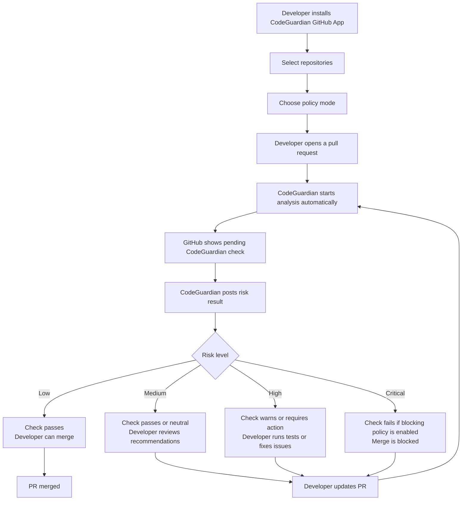
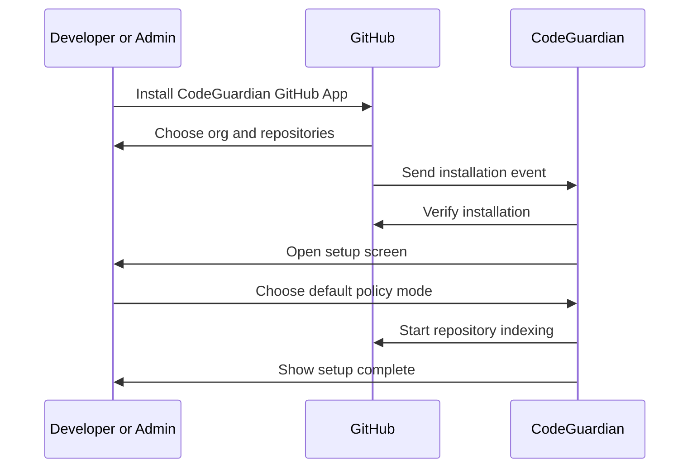
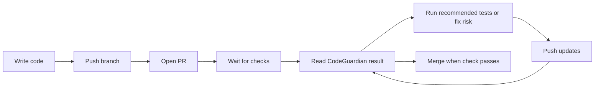
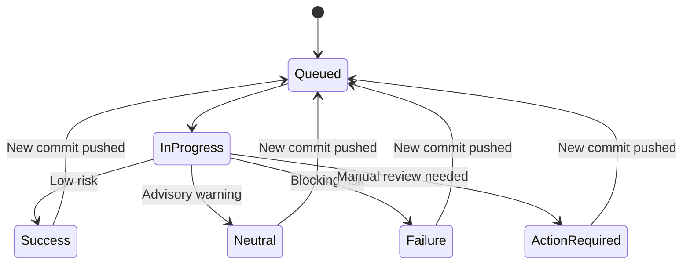
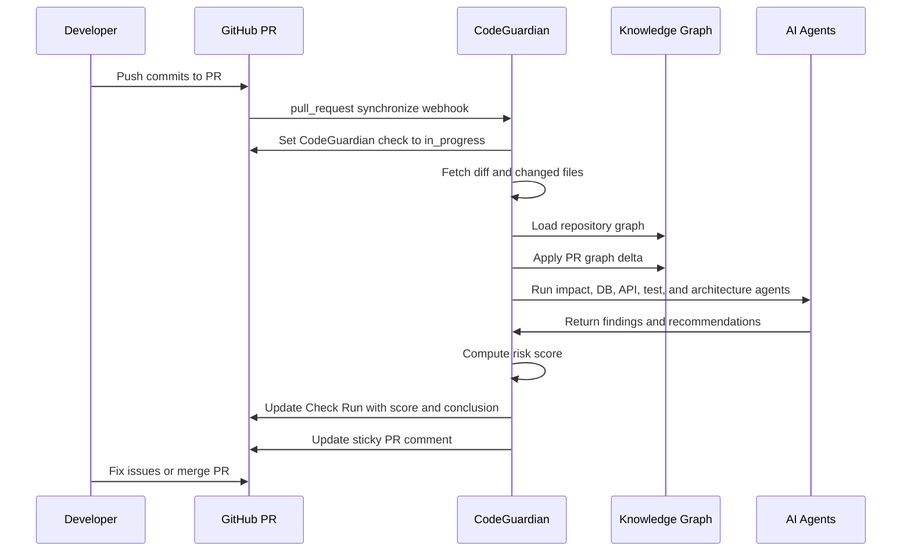
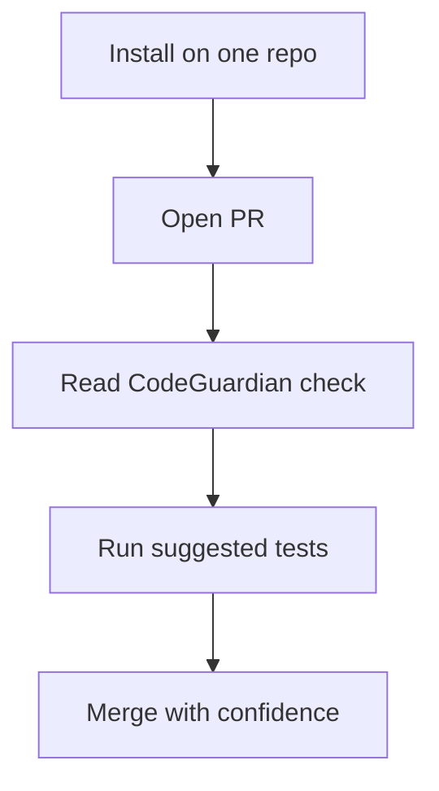
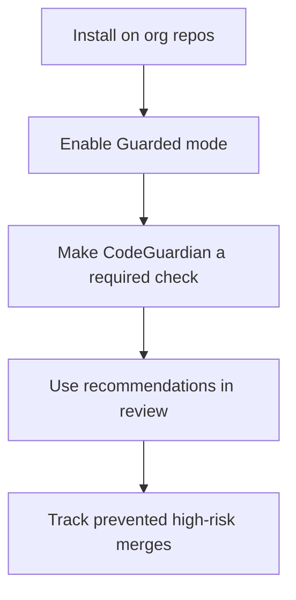
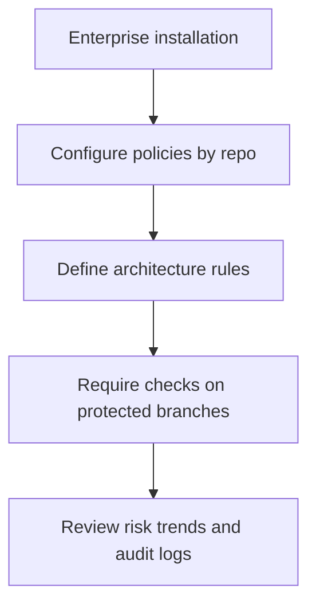

# CodeGuardian AI GitHub PR Flowmap

This document describes how a developer experiences CodeGuardian AI directly inside GitHub, especially on the pull request page near the merge/checks area.

The goal is for CodeGuardian to feel native to GitHub: a clear check, a concise risk summary, and merge guidance at the exact moment a developer is deciding whether a PR is safe.

## Product Principle

CodeGuardian should not force developers into a separate dashboard for routine use.

The default workflow should happen inside GitHub:

- Developer opens a PR.
- CodeGuardian analyzes the PR automatically.
- GitHub shows a CodeGuardian check near the merge area.
- Developer reads the risk result.
- Developer acts on recommended tests, reviews, or fixes.
- GitHub allows or blocks merge based on configured policy.

The dashboard is for deeper investigation, team settings, policies, graph exploration, billing, and long-term analytics. The PR page is the primary product surface.

## Guided User Flow



## First-Time Setup Flow



## Policy Modes

CodeGuardian should support three policy modes so teams can adopt gradually.

| Mode | GitHub Check Behavior | Best For |
| --- | --- | --- |
| Advisory | Always non-blocking, posts risk summary | Individual developers, early trials, open source |
| Guarded | Blocks only critical risks | Startup teams and active product teams |
| Strict | Blocks high and critical risks | Enterprise, platform teams, regulated workflows |

## Everyday Developer Flow



## GitHub PR Page Experience

CodeGuardian should appear in three places on the GitHub pull request page:

1. Checks area near the merge box.
2. Sticky PR summary comment.
3. Optional inline review annotations for high-confidence findings.

The most important surface is the merge/checks area because that is where the developer makes the final decision.

## PR Merge Box: Low Risk Example

```text
✅ All checks have passed

Required checks
✅ CodeGuardian Risk — 1.8 / 10 Low Risk
✅ CI / unit-tests
✅ CI / lint

CodeGuardian AI
This PR is low risk.

Affected areas:
- Web dashboard
- Button component styles

Recommended action:
- No additional test suite required beyond existing CI.

[View full risk report]

────────────────────────────────────────
Merge pull request
```

Expected behavior:

- Check conclusion: `success`.
- Merge is allowed.
- No noisy comments unless the repo has summary comments enabled.
- Dashboard link is available for details.

## PR Merge Box: Medium Risk Example

```text
✅ Checks completed with warnings

Required checks
⚠️ CodeGuardian Risk — 5.6 / 10 Medium Risk
✅ CI / unit-tests
✅ CI / lint

CodeGuardian AI
This PR may affect downstream behavior.

Affected services:
- Auth
- User Profile

Potential issues:
- Shared user type changed
- Profile endpoint response shape may be affected

Recommended actions:
- Run profile API integration tests
- Ask Auth owner to review changed type

[View full risk report]

────────────────────────────────────────
Merge pull request
```

Expected behavior:

- Check conclusion: `neutral` or `success`, depending on policy.
- Merge is allowed in Advisory mode.
- Merge is allowed in Guarded mode unless high-confidence breakage is found.
- Comment summary may be posted if enabled.

## PR Merge Box: High Risk Example

```text
⚠️ Some checks need attention

Required checks
❌ CodeGuardian Risk — 8.2 / 10 High Risk
✅ CI / unit-tests
✅ CI / lint

CodeGuardian AI
This PR has high merge risk.

Affected services:
- Auth
- Billing
- User Profile

Potential breakages:
- API contract mismatch in GET /api/profile
- Prisma schema changed without matching migration
- Billing integration tests do not cover changed auth path

Recommended actions:
- Add or update profile API regression test
- Review Prisma migration before merge
- Run billing integration suite

[View full risk report]

────────────────────────────────────────
Merge blocked by required check:
CodeGuardian Risk
```

Expected behavior:

- Check conclusion: `failure` if policy is Guarded or Strict.
- Merge is blocked when CodeGuardian is configured as a required check.
- Developer gets concrete next actions.
- Re-running analysis should happen automatically after new commits.

## PR Merge Box: Critical Risk Example

```text
❌ Pull request cannot be merged

Required checks
❌ CodeGuardian Risk — 9.4 / 10 Critical Risk
✅ CI / unit-tests
✅ CI / lint

CodeGuardian AI
This PR is likely to break production behavior.

Critical findings:
- Removes required database column used by BillingService
- No backward-compatible migration path detected
- Historical incident INC-104 involved a similar migration

Required actions:
- Add safe expand/contract migration
- Add rollback plan
- Request database owner review
- Re-run CodeGuardian after changes

[View full risk report]

────────────────────────────────────────
Merge blocked by required check:
CodeGuardian Risk
```

Expected behavior:

- Check conclusion: `failure`.
- Merge blocked in Guarded and Strict modes.
- Comment should be concise but direct.
- Full report contains graph evidence, changed files, historical context, and test recommendations.

## Sticky PR Summary Comment

The sticky PR summary comment should be updated in place instead of posting a new comment after every commit.

```markdown
## CodeGuardian AI Risk Report

**Risk Score:** 8.2 / 10 High

### Affected Services
- Auth
- Billing
- User Profile

### Potential Breakages
- API contract mismatch in `GET /api/profile`
- Prisma schema changed without matching migration
- Missing integration coverage for billing auth path

### Recommended Actions
- Run `billing:integration`
- Add profile API regression test
- Review migration with database owner

### Evidence
- `apps/api/profile/route.ts`
- `packages/auth/session.ts`
- `prisma/schema.prisma`
- Similar historical incident: `INC-104`

[Open full report in CodeGuardian]
```

## Inline Annotation Rules

Inline annotations should be used only when the finding maps to a specific changed line.

Good inline annotation:

```text
CodeGuardian AI
This route response removed `billingStatus`, but two clients still read that field.

Impacted clients:
- apps/web/profile/ProfileBilling.tsx
- apps/admin/users/BillingPanel.tsx
```

Avoid inline comments for broad or uncertain observations. Broad findings belong in the check summary.

## Check Run Lifecycle



## Detailed PR Analysis Flow



## What The Developer Sees

The developer should see only the information needed to make a merge decision.

Top-level GitHub PR output:

- Risk score.
- Risk label: Low, Medium, High, Critical.
- Merge impact summary.
- Affected services.
- Top 3 to 5 findings.
- Top 3 recommended actions.
- Full report link.

Full dashboard output:

- Complete dependency impact graph.
- All findings and evidence.
- Historical PR and incident similarity.
- Detailed test recommendations.
- Architecture rule details.
- Database migration analysis.
- AI reasoning trace with cited evidence.

## Merge Decision Matrix

| Risk | Advisory Mode | Guarded Mode | Strict Mode |
| --- | --- | --- | --- |
| Low | Pass | Pass | Pass |
| Medium | Pass with warning | Pass with warning | Requires review |
| High | Pass with warning | Block | Block |
| Critical | Pass with warning | Block | Block |

## User Journey By Persona

### Individual Developer



Primary value:

- Confidence before merge.
- Faster self-review.
- Better understanding of unfamiliar code.

### Startup Engineering Team



Primary value:

- Fewer broken merges.
- Lightweight architecture enforcement.
- Better test selection without heavy process.

### Enterprise Platform Team



Primary value:

- Centralized engineering governance.
- Branch protection integration.
- Auditability and long-term architecture memory.

## Ideal GitHub-Native UX

CodeGuardian should be:

- Fast enough that developers do not ignore it.
- Concise enough that it does not feel like spam.
- Specific enough that every warning has an action.
- Configurable enough that teams can choose whether it blocks merge.
- Evidence-backed enough that senior engineers trust it.

The best version of the product lives in the GitHub merge flow. The dashboard should deepen the experience, but GitHub should remain the place where developers understand and act on merge risk.

