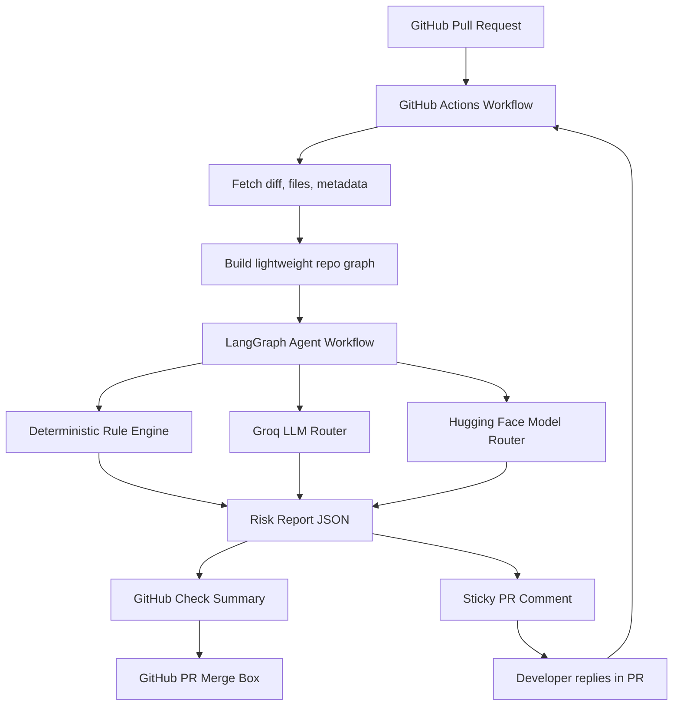
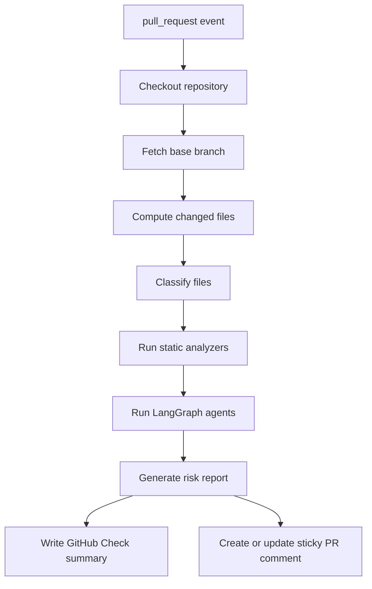
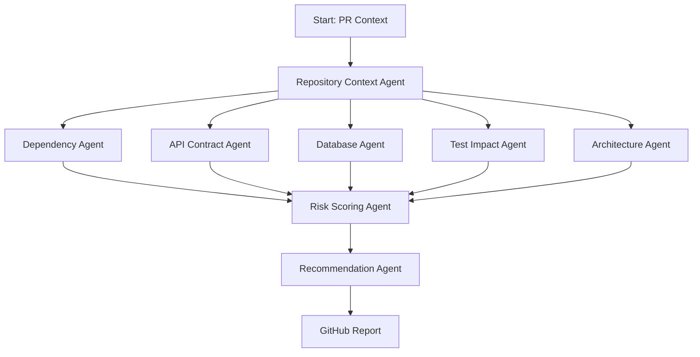
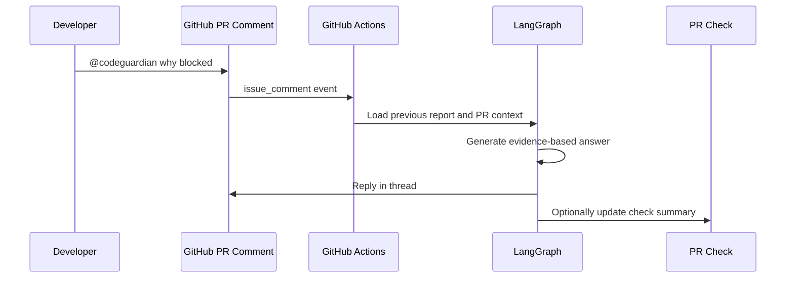
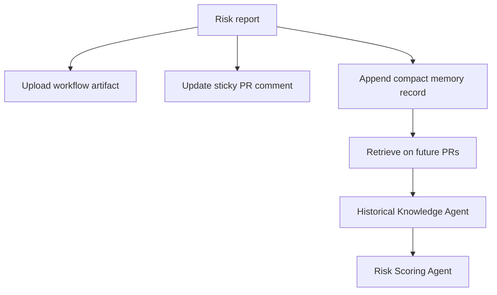
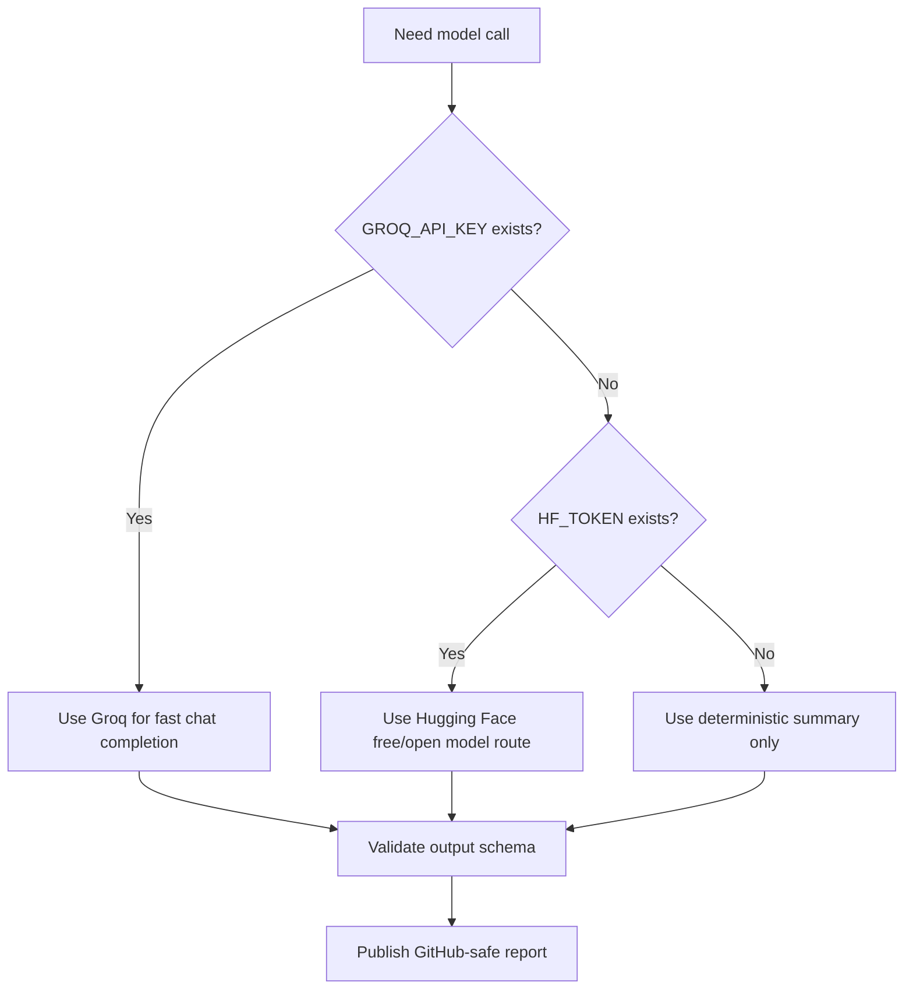

# CodeGuardian AI Phase-Wise Build Plan

This document converts the CodeGuardian AI blueprint into a practical build plan. It assumes the product is GitHub-native, runs through GitHub Actions, uses GitHub Checks as the merge-page surface, and keeps all developer interaction inside the pull request.

## Build Constraints

The implementation should follow these constraints:

- GitHub is the primary product surface.
- CodeGuardian appears as a GitHub PR check near the merge box.
- All developer conversation happens in PR comments and check output.
- Deployment and scheduled execution should be handled through GitHub Actions.
- The agentic AI workflow should use LangGraph.
- LLM routing should support Groq and Hugging Face free-tier/open models.
- The system should avoid requiring a separate always-on hosted SaaS for the MVP.
- The dashboard is optional later; the first product should work from GitHub alone.

## Target MVP Architecture



## GitHub Actions-Only Deployment Model

For MVP, CodeGuardian can run as a GitHub Action instead of a traditional hosted service. This makes adoption easier, reduces hosting cost, and keeps source code analysis inside the user's GitHub environment.

### How It Works

1. Team installs or copies the CodeGuardian workflow into `.github/workflows/codeguardian.yml`.
2. Workflow triggers on pull request events.
3. GitHub Action checks out the repository.
4. Action computes the diff against the base branch.
5. Action runs deterministic analyzers.
6. Action runs LangGraph agent workflow.
7. Action calls Groq and/or Hugging Face models using repository secrets.
8. Action publishes a GitHub Check summary.
9. Action creates or updates a sticky PR comment.
10. Developer replies to the PR comment for clarification or commands.
11. New comments can trigger a follow-up workflow.

### Required GitHub Events

```yaml
pull_request:
  types:
    - opened
    - reopened
    - synchronize
    - ready_for_review
pull_request_review_comment:
  types:
    - created
issue_comment:
  types:
    - created
workflow_dispatch:
```

This event list is illustrative only. The actual workflow file should be created during implementation.

### Required Secrets

| Secret | Purpose |
| --- | --- |
| `GROQ_API_KEY` | Fast hosted inference for supported open models |
| `HF_TOKEN` | Hugging Face Inference API or model access |
| `CODEGUARDIAN_MODE` | Optional policy mode override |

### GitHub Permissions

The Action should request only what it needs:

- `contents: read`
- `pull-requests: write`
- `checks: write`
- `issues: write`
- `actions: read`

## Phase 0: Product Definition And Repo Foundation

### Objective

Create the documentation, user journey, risk model, and GitHub-native product contract before implementation begins.

### Deliverables

- Product blueprint.
- GitHub PR user flowmap.
- Build plan.
- Workflow improvements document.
- Initial repository structure.
- Decision records for MVP constraints.

### Product Manager Prompt Template

```text
You are the Product Manager for CodeGuardian AI.

Goal:
Define the MVP user experience for a GitHub-native PR risk checker that runs through GitHub Actions and communicates entirely inside the pull request.

Context:
- Product name: CodeGuardian AI
- Tagline: Know what breaks before you merge.
- Primary surface: GitHub PR merge/checks area
- Secondary surface: sticky PR comment
- Deployment constraint: GitHub Actions only for MVP
- AI workflow: LangGraph agents
- LLM providers: Groq and Hugging Face free/open models

Tasks:
1. Define the exact user journey from installation to merge.
2. Define the PR check states: success, neutral, failure, action required.
3. Define the risk categories and scoring language.
4. Define when the Action should comment.
5. Define when it should stay quiet.
6. Define what a developer can reply in the PR comment.
7. Define acceptance criteria for MVP readiness.

Output format:
- User journey
- PR surfaces
- Risk score rubric
- Comment behavior rules
- Developer command list
- Acceptance criteria
- Open questions
```

### Senior Developer Prompt Template

```text
You are the Senior Developer responsible for the CodeGuardian AI MVP.

Goal:
Design the technical foundation for a GitHub Actions-based PR risk checker using LangGraph, deterministic analyzers, Groq, and Hugging Face.

Constraints:
- No always-on SaaS dependency for MVP.
- Must run inside GitHub Actions.
- Must publish output to GitHub Checks and PR comments.
- Must keep all analysis reproducible from repository state and PR diff.
- Must support JavaScript and TypeScript first.

Tasks:
1. Propose the repository structure.
2. Define core modules and responsibilities.
3. Define the analysis pipeline.
4. Define the LangGraph state schema.
5. Define the model routing strategy between Groq and Hugging Face.
6. Define retry, timeout, and fallback behavior.
7. Define how to avoid duplicate comments.
8. Define test strategy.

Output format:
- Architecture overview
- Module list
- Data contracts
- LangGraph node list
- GitHub integration details
- Failure handling
- Test plan
```

### User Prompt Template

```text
I am using CodeGuardian AI on my pull request.

Please explain:
1. Why my PR received this risk score.
2. Which files or services are affected.
3. Which tests I should run before merge.
4. Whether this blocks merge under my repository policy.
5. The smallest change I can make to reduce the risk.

Use only evidence from this PR and repository context.
Keep the answer concise and actionable.
```

## Phase 1: GitHub Actions PR Checker MVP

### Objective

Build the first working GitHub Action that analyzes PR diffs and posts a CodeGuardian risk report.

### Deliverables

- GitHub Action entrypoint.
- Pull request diff fetcher.
- Changed file classifier.
- Basic JavaScript and TypeScript import scanner.
- Risk scoring v0.
- GitHub Check summary writer.
- Sticky PR comment writer.
- No external dashboard.

### Workflow



### LangGraph MVP Nodes

| Node | Role |
| --- | --- |
| `collect_pr_context` | Load PR metadata, diff, commits, changed files |
| `classify_changes` | Identify frontend, backend, config, database, test, docs changes |
| `dependency_scan` | Find direct imports and likely impacted files |
| `test_recommendation` | Recommend tests using naming and import heuristics |
| `risk_score` | Produce category scores and final score |
| `llm_summarize` | Generate concise GitHub-ready report |
| `publish_result` | Write check output and sticky comment |

### Product Manager Prompt Template

```text
You are the Product Manager reviewing Phase 1 of CodeGuardian AI.

Evaluate whether the GitHub PR checker MVP is clear and useful for developers.

Inputs:
- Example PR diff summary
- CodeGuardian risk report
- GitHub check output
- Sticky PR comment

Review criteria:
1. Is the risk score understandable?
2. Are recommendations specific enough?
3. Is the PR comment too noisy?
4. Would this help a developer decide whether to merge?
5. What should be hidden, shortened, or promoted?

Output:
- Product verdict
- UX issues
- Recommended copy changes
- Merge-page improvements
- MVP acceptance decision
```

### Senior Developer Prompt Template

```text
You are the Senior Developer implementing Phase 1.

Build a GitHub Actions-based PR checker for CodeGuardian AI.

Technical requirements:
- Trigger on pull_request opened, synchronize, reopened, and ready_for_review.
- Fetch changed files and diff.
- Analyze JavaScript and TypeScript files.
- Detect high-risk file categories such as migrations, package manifests, API routes, auth, billing, and shared types.
- Build a lightweight dependency map from imports.
- Recommend tests based on changed file names, nearby tests, and import relationships.
- Run LangGraph nodes for structured analysis.
- Use Groq first for fast summarization when `GROQ_API_KEY` is present.
- Fall back to Hugging Face when `HF_TOKEN` is present.
- Fall back to deterministic summary if no model key exists.
- Publish a GitHub check summary.
- Create or update a sticky PR comment.

Output:
- Implementation plan
- Files to create
- Interfaces and schemas
- Error handling plan
- Test cases
```

### User Prompt Template

```text
@codeguardian explain this risk

Please explain why this PR was marked medium or high risk.
Focus on:
- Changed files
- Impacted services
- Missing tests
- Merge blocker status
- Recommended next action
```

## Phase 2: Agentic AI With LangGraph

### Objective

Move from simple analysis to agentic AI workflows with structured state, multiple agents, retries, and evidence-based synthesis.

### Deliverables

- LangGraph state schema.
- Dedicated agent nodes.
- Evidence store format.
- Model provider abstraction.
- Deterministic fallback mode.
- Prompt injection safeguards.
- Agent output validation.

### Agent Graph



### LangGraph State Contract

```text
CodeGuardianState
- pr
  - owner
  - repo
  - number
  - base_sha
  - head_sha
- diff
  - files
  - patches
  - stats
- repository
  - language_summary
  - framework_summary
  - package_manifests
  - test_files
- evidence
  - dependency_findings
  - api_findings
  - database_findings
  - architecture_findings
  - test_findings
  - historical_findings
- risk
  - score
  - level
  - confidence
  - blocking
- report
  - check_summary
  - pr_comment
  - annotations
```

### Product Manager Prompt Template

```text
You are the Product Manager defining the agentic AI behavior for CodeGuardian AI.

Goal:
Ensure the LangGraph agent workflow produces useful, trustworthy, and concise GitHub PR feedback.

Agent workflow:
- Repository Context Agent
- Dependency Agent
- API Contract Agent
- Database Agent
- Test Impact Agent
- Architecture Agent
- Risk Scoring Agent
- Recommendation Agent

Tasks:
1. Define what each agent is allowed to say.
2. Define what each agent must cite as evidence.
3. Define what should never be shown in the PR comment.
4. Define how confidence should be displayed.
5. Define how the system should behave when evidence is incomplete.

Output:
- Agent behavior rules
- Evidence requirements
- User-facing copy rules
- Failure and uncertainty behavior
```

### Senior Developer Prompt Template

```text
You are the Senior Developer building the LangGraph workflow for CodeGuardian AI.

Goal:
Implement a structured, evidence-based agent pipeline for PR risk analysis.

Technical requirements:
- Use LangGraph for orchestration.
- Persist state between nodes during a workflow run.
- Validate every agent output against a schema.
- Route LLM calls through a provider abstraction.
- Prefer Groq for low-latency summarization.
- Use Hugging Face free/open models as fallback.
- Use deterministic fallback when no provider is available.
- Ensure no model output can create a finding without evidence.
- Keep PR comments concise.

Output:
- LangGraph node design
- State schema
- Provider router design
- Validation rules
- Timeout and retry plan
- Test strategy
```

### User Prompt Template

```text
@codeguardian what changed since the last run?

Compare the current CodeGuardian result with the previous run on this PR.
Show:
- Risk score change
- New findings
- Resolved findings
- Remaining blockers
- Next recommended action
```

## Phase 3: GitHub PR Conversation Loop

### Objective

Allow developers to interact with CodeGuardian entirely inside GitHub PR comments.

### Supported Commands

| Command | Behavior |
| --- | --- |
| `@codeguardian explain` | Explain current risk report |
| `@codeguardian tests` | Show recommended tests |
| `@codeguardian why blocked` | Explain merge blocker |
| `@codeguardian recheck` | Re-run analysis |
| `@codeguardian ignore <finding-id>` | Request suppression if allowed |
| `@codeguardian compare` | Compare current and previous analysis |
| `@codeguardian summary` | Repost concise summary |

### Conversation Flow



### Product Manager Prompt Template

```text
You are the Product Manager designing PR comment interactions for CodeGuardian AI.

Goal:
Make CodeGuardian feel helpful inside GitHub without becoming noisy.

Tasks:
1. Define the supported PR commands.
2. Define the exact response style for each command.
3. Define when CodeGuardian should refuse or ask for clarification.
4. Define when a user command should trigger a full re-analysis.
5. Define how ignored findings should be represented.
6. Define how to avoid comment spam.

Output:
- Command list
- Response templates
- Noise-control rules
- Permission rules
- Abuse-prevention rules
```

### Senior Developer Prompt Template

```text
You are the Senior Developer building the PR conversation loop.

Technical requirements:
- Trigger on issue_comment and pull_request_review_comment events.
- Detect commands that mention @codeguardian.
- Ignore comments from bots unless explicitly allowed.
- Load the latest CodeGuardian report artifact.
- Route the command through a LangGraph conversation node.
- Reply in the PR thread.
- Do not create duplicate replies for the same comment.
- Support recheck by dispatching the PR analysis workflow.

Output:
- Event handling design
- Command parser design
- Idempotency strategy
- GitHub API calls required
- Security and permission checks
- Test cases
```

### User Prompt Template

```text
@codeguardian why blocked

Tell me:
- The exact finding that blocks merge
- Why it matters
- Which file introduced it
- What I should change
- Whether adding tests is enough or code must change
```

## Phase 4: Database, API, And Architecture Analysis

### Objective

Expand beyond simple dependency scanning into the product's strongest risk categories.

### Deliverables

- Prisma analyzer.
- SQL migration analyzer.
- API route analyzer.
- OpenAPI/GraphQL diff support if specs exist.
- Architecture rule config.
- Custom repository policy file.

### Policy File Concept

```text
codeguardian policy
- risk thresholds
- blocking mode
- architecture layers
- forbidden imports
- service owners
- high-risk paths
- test suite mappings
- ignored findings
```

### Product Manager Prompt Template

```text
You are the Product Manager defining advanced CodeGuardian risk categories.

Goal:
Make database, API, and architecture findings useful enough that teams trust CodeGuardian as a required PR check.

Tasks:
1. Define what makes a database migration high risk.
2. Define what makes an API change breaking.
3. Define common architecture violations for JavaScript and TypeScript repos.
4. Define how owner review should appear in the PR.
5. Define when a finding should block merge.

Output:
- Risk category definitions
- User-facing examples
- Blocking criteria
- Non-blocking warning criteria
- Required evidence for each category
```

### Senior Developer Prompt Template

```text
You are the Senior Developer building advanced analyzers for CodeGuardian AI.

Technical requirements:
- Detect Prisma schema changes.
- Detect missing or destructive migrations.
- Detect API route response or request shape changes when possible.
- Detect high-risk changes in shared types.
- Detect forbidden imports and layer violations.
- Support a repository policy file.
- Feed every finding into the LangGraph evidence state.
- Keep deterministic analyzers usable without LLMs.

Output:
- Analyzer design
- Policy file schema
- Finding schema
- Test fixtures
- Edge cases
- Limitations
```

### User Prompt Template

```text
@codeguardian explain database risk

Explain only the database-related risk in this PR.
Include:
- Changed schema or migration files
- Destructive operations if any
- Tables or models affected
- Whether this needs a rollback plan
- Whether this blocks merge
```

## Phase 5: Memory And Historical Learning

### Objective

Add long-term engineering memory while still operating from GitHub Actions.

### GitHub Actions-Friendly Memory Options

| Option | Description | MVP Fit |
| --- | --- | --- |
| PR artifacts | Store report JSON as workflow artifacts | Good for per-PR history |
| Repository branch | Store compact memory files in a protected branch | Good for OSS and simple teams |
| GitHub Issues | Store incidents and decisions as structured issues | Good for GitHub-native teams |
| External store later | Hosted DB, vector DB, graph DB | Better for SaaS phase |

### Memory Flow



### Product Manager Prompt Template

```text
You are the Product Manager defining CodeGuardian memory.

Goal:
Use historical PR outcomes to make future risk analysis more useful without requiring a hosted database in the MVP.

Tasks:
1. Define what memory should be stored after each PR.
2. Define what should never be stored.
3. Define how historical context should appear in GitHub PR comments.
4. Define retention rules.
5. Define how users can delete or ignore memory.

Output:
- Memory data model
- User-facing historical context rules
- Retention policy
- Privacy rules
- GitHub-native storage strategy
```

### Senior Developer Prompt Template

```text
You are the Senior Developer adding GitHub-native memory to CodeGuardian AI.

Technical requirements:
- Store compact JSON reports as workflow artifacts.
- Load the most recent relevant reports for the same PR.
- Optionally maintain compact memory files in a repository branch.
- Avoid storing secrets or large source code chunks.
- Feed historical matches into the LangGraph state.
- Use embeddings only if a provider is configured.
- Fall back to keyword and path matching.

Output:
- Storage design
- Retrieval design
- Data retention plan
- Privacy safeguards
- Test cases
```

### User Prompt Template

```text
@codeguardian has this happened before?

Look for similar previous risks in this repository.
Show:
- Similar PRs or incidents
- What broke before
- Whether this PR has the same pattern
- What action prevented or would have prevented the issue
```

## Phase 6: Packaging, Distribution, And Adoption

### Objective

Make CodeGuardian easy to install, configure, and trust as a GitHub-native PR checker.

### Deliverables

- Reusable GitHub Action.
- Marketplace-ready Action metadata.
- Example workflow file.
- Starter policy file.
- PR comment screenshots or examples.
- Onboarding guide.
- Troubleshooting guide.

### Product Manager Prompt Template

```text
You are the Product Manager preparing CodeGuardian AI for public adoption.

Goal:
Make setup simple enough that a developer can add CodeGuardian to a repo in under 10 minutes.

Tasks:
1. Define onboarding flow.
2. Define the default policy.
3. Define quick-start instructions.
4. Define what a successful first run looks like.
5. Define troubleshooting cases.
6. Define how to explain Groq and Hugging Face setup.

Output:
- Quick-start guide
- First-run success criteria
- Default settings
- Troubleshooting copy
- Adoption metrics
```

### Senior Developer Prompt Template

```text
You are the Senior Developer packaging CodeGuardian AI as a reusable GitHub Action.

Technical requirements:
- Provide Action metadata.
- Provide a minimal workflow example.
- Support repository-level config.
- Support Groq and Hugging Face model configuration.
- Work without model keys in deterministic mode.
- Publish check output and PR comments.
- Include integration tests using fixture PR diffs.

Output:
- Package plan
- Release process
- Versioning strategy
- Example workflow
- CI validation plan
```

### User Prompt Template

```text
I want to install CodeGuardian AI on this repository.

Give me:
- The workflow file I need
- The secrets I need to configure
- The default policy you recommend
- How I verify it works on a test PR
- How I make it a required check before merge
```

## Model Strategy

### Provider Priority



### Recommended Model Use

| Task | Preferred Route | Fallback |
| --- | --- | --- |
| Summarizing evidence | Groq | Hugging Face |
| Classifying risk text | Groq small/fast model | Deterministic rules |
| Embeddings | Hugging Face if available | Keyword/path matching |
| User comment replies | Groq | Hugging Face or deterministic template |

### Prompt Safety Rules

- Treat repository code and comments as untrusted input.
- Do not let model output create findings without analyzer evidence.
- Require structured JSON from model nodes.
- Validate every model response.
- Redact secrets before sending context.
- Keep PR comments concise.
- Link to full details in check summary or artifact when possible.

## GitHub PR Merge Page Output Contract

The GitHub check should always include:

- Risk score.
- Risk level.
- Blocking status.
- Affected areas.
- Top findings.
- Recommended actions.
- How to ask follow-up questions in the PR.

Example:

```text
CodeGuardian Risk: 8.2 / 10 High

Merge status: Blocked by repository policy

Affected areas:
- Auth
- Billing
- User Profile

Top findings:
1. API contract risk in GET /api/profile
2. Prisma schema changed without matching migration
3. Billing integration coverage missing

Recommended actions:
1. Add profile API regression test
2. Review migration rollback path
3. Run billing integration suite

Ask in this PR:
- @codeguardian why blocked
- @codeguardian tests
- @codeguardian explain database risk
```

## Definition Of Done For MVP

MVP is ready when:

- A repository can install the workflow and run CodeGuardian on PRs.
- The PR merge area shows a CodeGuardian check.
- The check output includes a risk score and recommendations.
- A sticky PR comment is created and updated without duplicates.
- Developer replies can trigger at least `explain`, `tests`, and `recheck`.
- LangGraph orchestrates the analysis pipeline.
- Groq and Hugging Face providers are supported.
- Deterministic fallback works without model keys.
- Merge blocking works through required GitHub checks.
- The product is useful without leaving GitHub.

