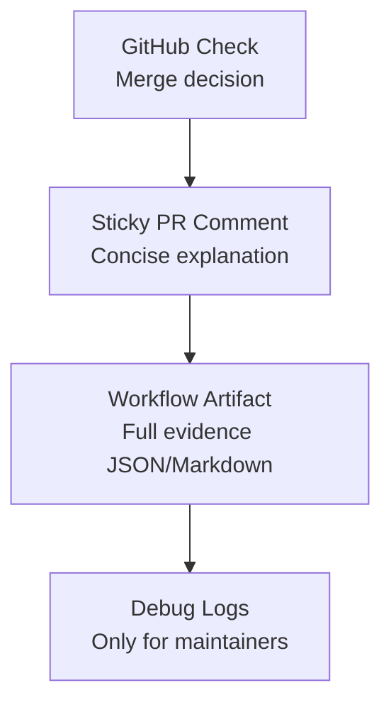
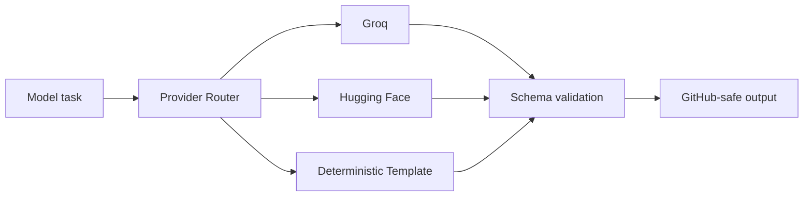
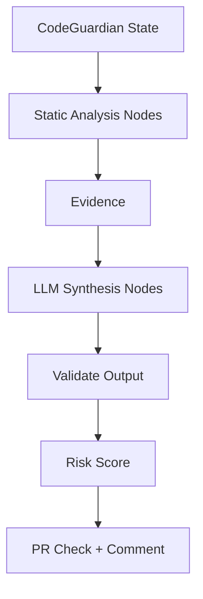
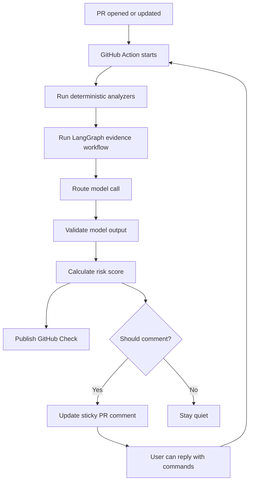

# CodeGuardian AI Workflow Improvements

This document captures improvements to the GitHub-native workflow beyond the baseline product plan. These ideas are meant to make CodeGuardian more useful inside the pull request while avoiding noisy bot behavior.

## 1. Keep GitHub As The Primary Product Surface

Improvement:

- Treat the GitHub PR check as the main interface.
- Treat the PR comment as the conversation layer.
- Treat external dashboards as optional future depth, not required daily workflow.

Why:

Developers make merge decisions inside GitHub. Forcing a dashboard visit creates friction and weakens adoption.

Recommended behavior:

- Put the merge decision in the check summary.
- Put the short explanation in the sticky PR comment.
- Put deeper evidence in collapsible sections or artifacts.
- Allow follow-up commands through PR comments.

## 2. Use A Sticky Comment, Not Repeated Comments

Improvement:

- Create one CodeGuardian summary comment per PR.
- Update that comment after every analysis run.
- Reply only when a user explicitly asks a question.

Why:

Repeated bot comments create notification fatigue and make the review thread hard to read.

Implementation rule:

```text
Find existing comment containing:
<!-- codeguardian-ai-summary -->

If found:
  update it
Else:
  create it
```

## 3. Separate Merge Decision From Detailed Analysis

Improvement:

- The check summary should answer: "Can I merge?"
- The PR comment should answer: "Why?"
- The full artifact/report should answer: "Show me all evidence."

Why:

The merge box has limited attention. It should not become a long report.

Suggested hierarchy:



## 4. Add Developer Commands In PR Comments

Improvement:

Support a small set of explicit commands:

- `@codeguardian explain`
- `@codeguardian tests`
- `@codeguardian why blocked`
- `@codeguardian recheck`
- `@codeguardian compare`
- `@codeguardian ignore <finding-id>`

Why:

This keeps interaction inside the PR and avoids needing a chat UI or dashboard during MVP.

Command handling rules:

- Commands must mention `@codeguardian`.
- Ignore bot-authored comments.
- Reply in-thread when possible.
- Do not run full analysis unless command requires it.
- Use the latest saved report for quick answers.

## 5. Add A Deterministic Fallback Mode

Improvement:

CodeGuardian should work even when Groq or Hugging Face tokens are missing.

Why:

Users may want to test the Action before configuring model keys. Open-source projects may avoid external model calls.

Fallback behavior:

- Run static analyzers.
- Generate template-based summaries.
- Skip natural-language deep reasoning.
- Clearly label the report as deterministic mode.

Example:

```text
CodeGuardian ran in deterministic mode because no model provider token was configured.
Risk score and recommendations are based on static analysis only.
```

## 6. Make Model Routing Explicit

Improvement:

Use a provider router with a clear priority:

1. Groq for fast PR summarization and user replies.
2. Hugging Face for free/open fallback models and embeddings.
3. Deterministic templates when no model key exists.

Why:

This keeps latency low, cost low, and the system robust.



## 7. Use LangGraph For State, Not Vibes

Improvement:

LangGraph should orchestrate clearly defined analysis nodes with typed state and validated outputs.

Why:

Agentic AI gets unreliable when agents freely chat with each other. CodeGuardian needs predictable evidence flow.

Recommended LangGraph pattern:

- One shared state object.
- Deterministic nodes first.
- LLM nodes only after evidence is collected.
- Validation after every LLM node.
- Final report generated from structured findings.



## 8. Add Confidence And Evidence To Every Finding

Improvement:

Every finding should include:

- Finding ID.
- Category.
- Severity.
- Confidence.
- Evidence files.
- Recommended action.
- Blocking status.

Why:

This makes findings reviewable, suppressible, and easier to debug.

Example:

```text
Finding: CG-API-004
Category: API Contract
Severity: High
Confidence: 0.82
Evidence:
- apps/api/profile/route.ts
- apps/web/profile/ProfileBilling.tsx
Action:
- Add profile API regression test
Blocking:
- Yes in Guarded and Strict mode
```

## 9. Improve Merge Blocking Gradually

Improvement:

Do not block merges by default for new teams.

Recommended rollout:

1. Advisory mode for first week.
2. Guarded mode after the team trusts reports.
3. Strict mode only for critical repos or regulated workflows.

Why:

If the first experience blocks a merge incorrectly, teams may uninstall it.

## 10. Add Noise Budgets

Improvement:

Allow teams to control how much CodeGuardian says.

Settings:

- Maximum findings in check summary.
- Maximum findings in PR comment.
- Whether to allow inline comments.
- Whether medium risks should comment.
- Whether docs-only changes should skip comments.

Why:

Different teams have different tolerance for automation in reviews.

## 11. Support Docs-Only And Low-Risk Fast Path

Improvement:

If a PR only changes docs, comments, formatting, or low-risk files, CodeGuardian should complete quickly and avoid posting a long comment.

Example:

```text
CodeGuardian Risk: 0.8 / 10 Low

Docs-only or low-risk change detected.
No additional action recommended.
```

Why:

Quiet correctness builds trust.

## 12. Persist Reports As Workflow Artifacts

Improvement:

Every run should upload a compact report artifact:

- `codeguardian-report.json`
- `codeguardian-report.md`

Why:

This provides history without a hosted database.

Benefits:

- Compare previous runs.
- Debug risk scoring.
- Support PR comment commands.
- Create historical memory later.

## 13. Add Recheck Without Pushing A Commit

Improvement:

Support:

```text
@codeguardian recheck
```

Why:

A developer may change configuration, add secrets, rerun CI, or want a fresh analysis without pushing an empty commit.

## 14. Add Suppression With Accountability

Improvement:

Allow maintainers to suppress a finding with a reason.

Example:

```text
@codeguardian ignore CG-DB-002 reason: migration is backward-compatible because the column is unused
```

Rules:

- Only maintainers can suppress blocking findings.
- Suppression must include a reason.
- Suppression should be visible in the PR comment.
- Suppression should expire or be scoped to a PR by default.

## 15. Add A Policy File

Improvement:

Support a repository config file.

Suggested file:

```text
.codeguardian/policy.yml
```

Policy should define:

- Risk thresholds.
- Blocking mode.
- High-risk paths.
- Architecture layers.
- Forbidden imports.
- Service owners.
- Test suite mappings.
- Comment noise settings.

Why:

Repository-specific context is necessary for useful risk analysis.

## 16. Add Service Ownership Hints

Improvement:

Read `CODEOWNERS` and policy mappings to suggest reviewers.

Example:

```text
Recommended reviewers:
- @platform/db for migration risk
- @team-auth for session type changes
```

Why:

The best action is often not just "fix this", but "ask the right person."

## 17. Add Compare Mode

Improvement:

Support:

```text
@codeguardian compare
```

Response should show:

- Previous risk score.
- Current risk score.
- New findings.
- Resolved findings.
- Remaining blockers.

Why:

Developers need to know whether their latest push actually reduced risk.

## 18. Use Progressive Disclosure In Reports

Improvement:

Keep the default visible output short, with expandable details.

Suggested comment structure:

```markdown
## CodeGuardian AI Risk Report

Risk: 8.2 / 10 High
Merge: Blocked

Top actions:
1. Add profile API regression test
2. Review Prisma migration
3. Run billing integration suite

<details>
<summary>Evidence</summary>
...
</details>
```

Why:

GitHub comments can become visually heavy. Progressive disclosure keeps the PR readable.

## 19. Protect Against Prompt Injection

Improvement:

Repository files and PR comments should be treated as untrusted input.

Rules:

- Never allow repository text to override system instructions.
- Do not send secrets to LLMs.
- Do not execute model-suggested commands.
- Require analyzer evidence for every finding.
- Validate model output schema.

Why:

Code analysis products process attacker-controlled text, especially in public repositories.

## 20. Recommended MVP Workflow

The improved MVP workflow should be:



This workflow keeps CodeGuardian useful, GitHub-native, low-cost, and trustworthy while leaving room for a future hosted SaaS version.

