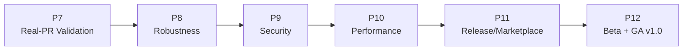

# CodeGuardian AI — Production & Shipment Plan (v1.0)

The MVP (Phases 0–6) is **delivered**: a GitHub-Actions-native, deterministic-first
pre-merge risk checker with a LangGraph workflow, `@codeguardian` conversation
loop, deep analyzers, GitHub-native memory, and packaging. The MVP build record is
archived under [archive/](archive/).

This plan covers the **next upgrade: harden the Action and ship v1.0 to the GitHub
Marketplace.** It stays deliberately **GitHub-Actions-native** — no hosted SaaS,
no database, no dashboard (those remain out of scope per
[CLAUDE.md](../../CLAUDE.md) until explicitly chosen). Direction chosen 2026-06-27.

## Goal

Take the working MVP from "passes local tests" to "trusted, published, versioned
product running on real repositories at v1.0."

## Phase Documents

| Phase | Document | Outcome |
| --- | --- | --- |
| 7 | [Real-PR Validation & E2E Hardening](phase-7-real-pr-validation.md) | Proven on live public/private/fork PRs; live-API edge cases handled |
| 8 | [Robustness & Observability](phase-8-robustness-observability.md) | Never-crash Action, retries/timeouts, job-summary, structured logs |
| 9 | [Security & Supply-Chain Hardening](phase-9-security-hardening.md) | Pinned actions, fork-PR safety, SECURITY.md, threat model, signed releases |
| 10 | [Performance & Scale](phase-10-performance-scale.md) | Fast on large repos/diffs; cached graph; memory retention/compaction |
| 11 | [Release Engineering & Marketplace](phase-11-release-marketplace.md) | Automated versioned releases, Marketplace listing, robust dependency packaging |
| 12 | [Beta, Tuning & v1.0 GA](phase-12-beta-and-ga.md) | Dogfood + beta feedback, scoring tuned, v1.0 general availability |

## Recommended Order

P7 first: live behavior must be proven before hardening the right things. P8–P10
can partially overlap. P11–P12 gate the public release.

## Definition Of Production-Ready (v1.0 done)

- Verified on real public, private, and fork PRs — all surfaces render correctly.
- The Action never hard-crashes; every failure degrades gracefully and is reported.
- All third-party actions pinned to SHAs; fork-PR secret exposure is impossible;
  SECURITY.md + threat model published; releases are signed and reproducible.
- Acceptable performance on large repos (documented budgets; no timeouts on
  typical PRs); memory branch growth is bounded.
- Automated, versioned releases on the Marketplace with a moving `v1` tag.
- Default policy tuned against real beta feedback (low false-positive rate).
- v1.0 tagged, changelogged, and announced.

## Working rules (unchanged)

Deterministic-first; every finding cites evidence; quiet by default; zero-key path
must always work; idempotency; treat all repo text as untrusted. See
[CLAUDE.md](../../CLAUDE.md) strict rules — they still bind this plan.
