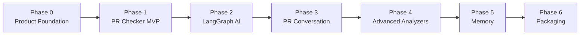

# CodeGuardian AI Build Phases — MVP (ARCHIVED, ✅ DELIVERED)

> **Status:** Phases 0–6 are **implemented, tested, and shipped** in the MVP.
> These documents are kept as the historical build record. Active work has moved
> to the production-hardening plan: see [../README.md](../README.md).

This folder breaks the CodeGuardian AI MVP build plan into detailed phase documents. Each phase is designed to be actionable for a product manager, senior developer, and end user.

The MVP direction is intentionally GitHub-native:

- Runs through GitHub Actions.
- Uses GitHub Checks as the PR merge-page surface.
- Uses sticky PR comments for conversation.
- Uses LangGraph for agentic workflow orchestration.
- Uses Groq and Hugging Face free/open model routes.
- Works in deterministic mode when no model credentials are configured.

## Phase Documents

| Phase | Document | Outcome |
| --- | --- | --- |
| 0 | [Phase 0: Product Foundation](phase-0-product-foundation.md) | Clear product contract and GitHub-native UX |
| 1 | [Phase 1: GitHub Actions PR Checker MVP](phase-1-github-actions-pr-checker.md) | First working PR risk checker |
| 2 | [Phase 2: LangGraph Agentic AI](phase-2-langgraph-agentic-ai.md) | Structured multi-agent risk analysis |
| 3 | [Phase 3: PR Conversation Loop](phase-3-pr-conversation-loop.md) | User interaction inside GitHub comments |
| 4 | [Phase 4: Advanced Analyzers](phase-4-advanced-analyzers.md) | Database, API, and architecture analysis |
| 5 | [Phase 5: Memory And Historical Learning](phase-5-memory-and-history.md) | GitHub-native memory and historical context |
| 6 | [Phase 6: Packaging And Adoption](phase-6-packaging-and-adoption.md) | Reusable Action, onboarding, and release |

## Recommended Build Order

## Definition Of Overall MVP Done

- A repository can run CodeGuardian from GitHub Actions.
- A PR receives a GitHub check called `CodeGuardian Risk`.
- The check appears in the PR merge area.
- The result includes risk score, risk level, findings, and recommended actions.
- A sticky PR comment is updated without duplicates.
- Developers can ask follow-up questions with `@codeguardian`.
- LangGraph orchestrates the analysis workflow.
- Groq and Hugging Face are supported model providers.
- Deterministic fallback works without model keys.
- Merge blocking works through GitHub required checks.

