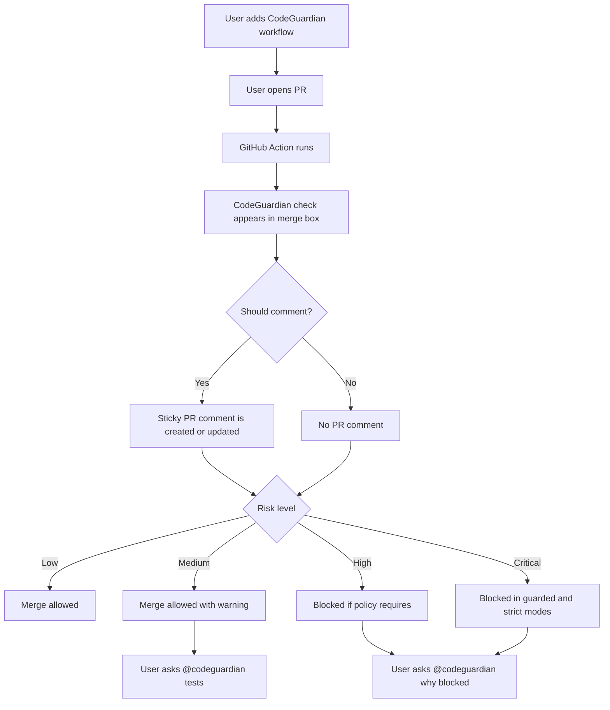

# Phase 0: Product Foundation

## Objective

Define the product contract before implementation. CodeGuardian must be clear about what it does inside GitHub, when it speaks, when it blocks merge, and how developers interact with it.

## Core Decisions

- Primary product surface: GitHub PR merge/checks area.
- Secondary product surface: sticky PR comment.
- Interaction model: PR comments with `@codeguardian` commands.
- Deployment model: GitHub Actions-only for MVP.
- AI orchestration: LangGraph.
- Model providers: Groq first, Hugging Face fallback, deterministic mode if no keys exist.
- Blocking mechanism: GitHub required checks.

## Deliverables

- Final MVP user journey.
- Risk score rubric.
- Merge blocking policy.
- PR check copy guidelines.
- Sticky comment format.
- Supported PR commands.
- Product acceptance criteria.

## User Journey



## Risk Levels

| Score | Level | Default Behavior |
| --- | --- | --- |
| 0.0-3.0 | Low | Pass |
| 3.1-6.0 | Medium | Warn |
| 6.1-8.5 | High | Block in Guarded or Strict mode |
| 8.6-10.0 | Critical | Block in Guarded or Strict mode |

## Product Manager Prompt

```text
You are the Product Manager for CodeGuardian AI.

Define the MVP GitHub PR experience for a product that predicts merge risk.

Constraints:
- Runs through GitHub Actions.
- Appears as a GitHub PR check.
- Uses sticky PR comments for conversation.
- Uses LangGraph for agentic analysis.
- Supports Groq and Hugging Face free/open model routes.
- Must work without model keys in deterministic mode.

Produce:
1. The end-to-end user journey.
2. The exact PR check fields.
3. The sticky comment structure.
4. The merge blocking policy.
5. The supported @codeguardian commands.
6. Rules for reducing bot noise.
7. MVP acceptance criteria.
```

## Senior Developer Prompt

```text
You are the Senior Developer for CodeGuardian AI Phase 0.

Context loading:
- Read CONTEXT-GRAPH.md first.
- Then open only ROOT, PLAN, P0, and WFI unless the graph points you elsewhere.

Create a technical foundation plan for the GitHub Actions-only MVP.

Define:
1. Repository structure.
2. GitHub Actions workflow triggers.
3. Required permissions.
4. Data contracts for PR context, findings, reports, and comments.
5. LangGraph state shape.
6. Model provider configuration for Groq and Hugging Face.
7. Deterministic fallback behavior.
8. Security rules for untrusted PR content.
```

## User Prompt

```text
@codeguardian help

Explain what CodeGuardian can do in this PR.
Show the commands I can use and what each command returns.
Keep it short.
```

## Acceptance Criteria

- The product can be explained in one sentence.
- Every PR surface has a purpose.
- Risk levels are easy to understand.
- Blocking behavior is explicit.
- User commands are limited and memorable.
- The technical team can begin implementation without unresolved product ambiguity.
