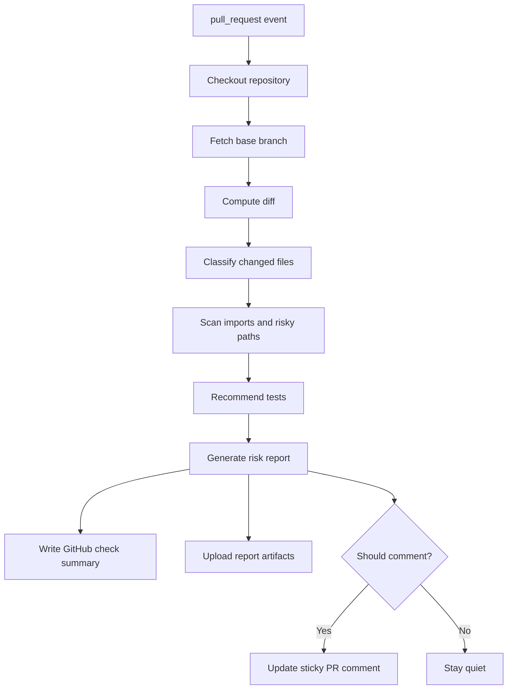

# Phase 1: GitHub Actions PR Checker MVP

## Objective

Build the first working CodeGuardian PR checker that runs inside GitHub Actions and publishes a `CodeGuardian Risk` check to the pull request merge area.

## Scope

Included:

- GitHub Actions workflow.
- PR diff collection.
- Changed file classification.
- Basic JavaScript and TypeScript analysis.
- Lightweight dependency scanning.
- Basic test recommendations.
- Risk report generation.
- GitHub Check output.
- Sticky PR comment.

Excluded:

- Hosted dashboard.
- Persistent external database.
- Full graph database.
- Deep semantic analysis.
- Enterprise installation flow.

## Workflow



## Publishing Contract

- The GitHub check answers whether the PR can merge under the current policy.
- The sticky PR comment explains the short why, only when the run is worth interrupting the PR.
- The uploaded artifacts contain the full evidence trail for debugging, compare mode, and follow-up commands.
- Low-risk docs-only changes should still publish a passing check and artifacts, but should skip a long comment by default.
- Deterministic mode must be clearly labeled when no model provider is configured.

## Required Inputs

- GitHub event payload.
- Base SHA.
- Head SHA.
- Changed files.
- Unified diff patches.
- Repository file tree.
- Optional `.codeguardian/policy.yml`.
- Optional `GROQ_API_KEY`.
- Optional `HF_TOKEN`.

## Outputs

- `codeguardian-report.json`
- `codeguardian-report.md`
- GitHub check summary.
- Sticky PR comment when policy allows it.
- Comment decision metadata.
- Exit code that can pass or fail required check.

## Finding Schema

```text
finding
- id
- category
- severity
- confidence
- title
- summary
- evidence_files
- recommended_actions
- blocking
```

## Senior Developer Prompt

```text
You are implementing Phase 1 of CodeGuardian AI.

Context loading:
- Read CONTEXT-GRAPH.md first.
- Then open only ROOT, PLAN, P1, P2, and WFI unless the graph points you elsewhere.

Build a GitHub Actions PR checker that:
- Runs on pull_request opened, synchronize, reopened, and ready_for_review.
- Checks out the repo and fetches the base branch.
- Computes changed files and patches.
- Classifies files by risk category.
- Scans JS/TS imports for likely dependency impact.
- Recommends tests using file naming and import heuristics.
- Generates a risk score.
- Publishes a GitHub check summary.
- Creates or updates one sticky PR comment.
- Uploads report JSON and Markdown artifacts.
- Works without LLM keys.
- Skips PR comments for docs-only or low-risk changes unless policy asks for them.
- Keeps the check summary short and links to artifacts for full evidence.

Return:
1. File structure.
2. Implementation steps.
3. Data schemas.
4. Error handling.
5. Test fixtures.
6. Acceptance criteria.
```

## Product Manager Prompt

```text
You are reviewing the Phase 1 MVP.

Given a sample PR and CodeGuardian output, decide whether the check is useful.

Evaluate:
1. Is the score understandable?
2. Are affected areas clear?
3. Are recommendations actionable?
4. Is the comment too long?
5. Would a developer trust this enough to act?

Return:
- Product verdict
- Copy improvements
- Missing information
- Noise concerns
- Launch readiness
```

## User Prompt

```text
@codeguardian explain

Explain the current risk score.
Tell me:
- What changed
- Why it matters
- Which tests I should run
- Whether this blocks merge
```

## Acceptance Criteria

- The Action runs successfully on a sample PR.
- The check appears in the GitHub PR merge area.
- The sticky comment updates in place.
- Docs-only changes produce low-risk output.
- Docs-only changes do not create noisy long comments by default.
- High-risk path changes produce visible warnings.
- The report artifact is uploaded.
- No LLM key is required for baseline operation.
