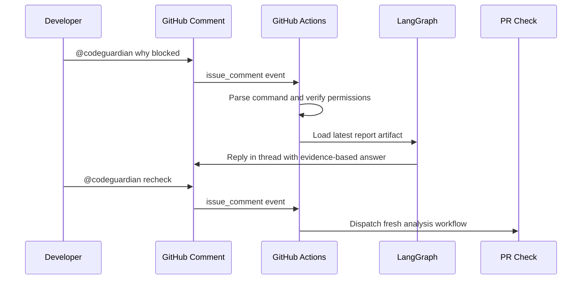

# Phase 3: PR Conversation Loop

## Objective

Allow developers to talk to CodeGuardian directly inside GitHub pull request comments.

## Supported Commands

| Command | Response |
| --- | --- |
| `@codeguardian help` | Show available commands |
| `@codeguardian explain` | Explain current risk |
| `@codeguardian tests` | Show recommended tests |
| `@codeguardian why blocked` | Explain merge blocker |
| `@codeguardian compare` | Compare current and previous run |
| `@codeguardian recheck` | Trigger a new analysis |
| `@codeguardian ignore <finding-id> reason: ...` | Request finding suppression |

## Conversation Flow



## Command Rules

- Ignore comments that do not mention `@codeguardian`.
- Ignore bot comments unless specifically allowlisted.
- Replies should be short.
- Use latest report artifacts when possible.
- Re-run full analysis only for `recheck`.
- Use deterministic templates for simple replies when no model key is configured.
- Suppression requires a reason.
- Blocking suppression requires maintainer permission.
- Suppressed findings remain visible in the sticky summary with the user, reason, and scope.
- Commands should not update the sticky summary unless they change analysis state, such as `recheck` or approved `ignore`.

## Idempotency And Noise Control

- Store the handled GitHub comment ID in the run state or artifact metadata.
- Do not reply twice to the same command comment.
- Prefer threaded replies when GitHub supports the source comment type.
- Keep command replies concise and link back to the latest check or artifact for full evidence.
- Refuse ambiguous or unsupported commands with a short help response.

## Senior Developer Prompt

```text
You are implementing Phase 3 of CodeGuardian AI.

Context loading:
- Read CONTEXT-GRAPH.md first.
- Then open only ROOT, PLAN, P3, P1, and P5 unless the graph points you elsewhere.

Build the GitHub PR comment interaction loop.

Requirements:
- Trigger on issue_comment and pull_request_review_comment.
- Detect @codeguardian commands.
- Parse command intent and arguments.
- Verify user permissions for recheck and ignore.
- Load latest codeguardian-report.json artifact.
- Route responses through LangGraph conversation node.
- Reply to the user in GitHub.
- Avoid duplicate replies for the same comment.
- Support recheck by triggering the PR analysis workflow.
- Keep `explain`, `tests`, `why blocked`, and `compare` read-only against the latest artifact.
- Record approved suppressions with actor, reason, finding ID, and PR scope.

Output:
1. Event handling design.
2. Command parser.
3. Permission rules.
4. Idempotency strategy.
5. GitHub API calls.
6. Response templates.
7. Test cases.
```

## Product Manager Prompt

```text
You are designing CodeGuardian's GitHub comment UX.

Define the behavior for each @codeguardian command.

For each command, provide:
- Trigger phrase
- Response goal
- Response template
- When to refuse
- Whether it updates the check
- Whether it triggers analysis

Also define:
- Noise-control rules
- Abuse-prevention rules
- Suppression policy
```

## User Prompt

```text
@codeguardian why blocked

Tell me exactly why this PR cannot merge.
Show the blocking finding, evidence files, and smallest fix.
```

## Acceptance Criteria

- `@codeguardian help` works.
- `@codeguardian explain` uses latest report.
- `@codeguardian tests` returns recommended tests.
- `@codeguardian recheck` dispatches analysis.
- `@codeguardian compare` uses current and previous report artifacts.
- `@codeguardian ignore` requires a reason and maintainer permission for blockers.
- Duplicate replies are prevented.
- Maintainer-only actions are protected.
