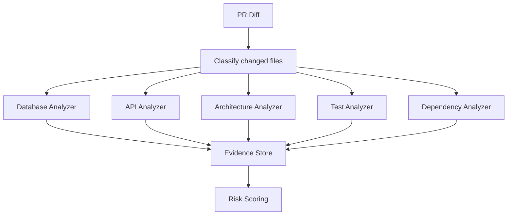

# Phase 4: Advanced Analyzers

## Objective

Expand CodeGuardian from a general PR checker into a strong engineering consequence analyzer for databases, APIs, architecture boundaries, and tests.

## Analyzer Categories

| Analyzer | Detects |
| --- | --- |
| Database | Prisma changes, SQL migrations, destructive operations, missing migrations |
| API | Route changes, request/response shape changes, OpenAPI/GraphQL drift |
| Architecture | Forbidden imports, layer violations, circular dependencies |
| Tests | Missing tests, impacted test suites, coverage gaps |
| Dependency | Transitive impact, package manifest risk, shared type changes |

## Advanced Analysis Flow



## Policy File

Recommended location:

```text
.codeguardian/policy.yml
```

Policy areas:

- Mode: advisory, guarded, strict.
- Risk thresholds.
- High-risk paths.
- Service owners.
- Test suite mappings.
- Architecture layers.
- Forbidden imports.
- Suppression rules.
- Comment noise settings.

## Senior Developer Prompt

```text
You are implementing Phase 4 advanced analyzers for CodeGuardian AI.

Context loading:
- Read CONTEXT-GRAPH.md first.
- Then open only ROOT, PLAN, P4, P1, and P2 unless the graph points you elsewhere.

Build deterministic analyzers for:
1. Prisma schema changes.
2. SQL migration risk.
3. API route changes.
4. Shared TypeScript type changes.
5. Architecture boundary violations.
6. Test impact and missing coverage.

Requirements:
- Every finding must include evidence.
- Every analyzer must work without LLMs.
- Analyzer output must feed LangGraph state.
- Policy file settings must affect scoring and blocking.
- High-confidence findings can block merge.

Output:
- Analyzer design
- Policy schema
- Finding examples
- Edge cases
- Test fixtures
- Acceptance criteria
```

## Product Manager Prompt

```text
You are defining the advanced CodeGuardian risk categories.

For database, API, architecture, and test findings, define:
- What counts as low, medium, high, and critical risk.
- What evidence is required.
- What action the developer should take.
- When the finding blocks merge.
- How the finding should appear in GitHub.

Return:
- Risk rubric
- User-facing examples
- Blocking rules
- Copy guidelines
```

## User Prompt

```text
@codeguardian explain database risk

Focus only on database-related findings.
Show changed migration or schema files, destructive operations, affected models, and required action.
```

## Acceptance Criteria

- Prisma schema changes are detected.
- Destructive migrations are flagged.
- API route changes generate contract findings where possible.
- Forbidden imports are detected.
- Test recommendations improve beyond filename matching.
- Policy file changes alter behavior.
