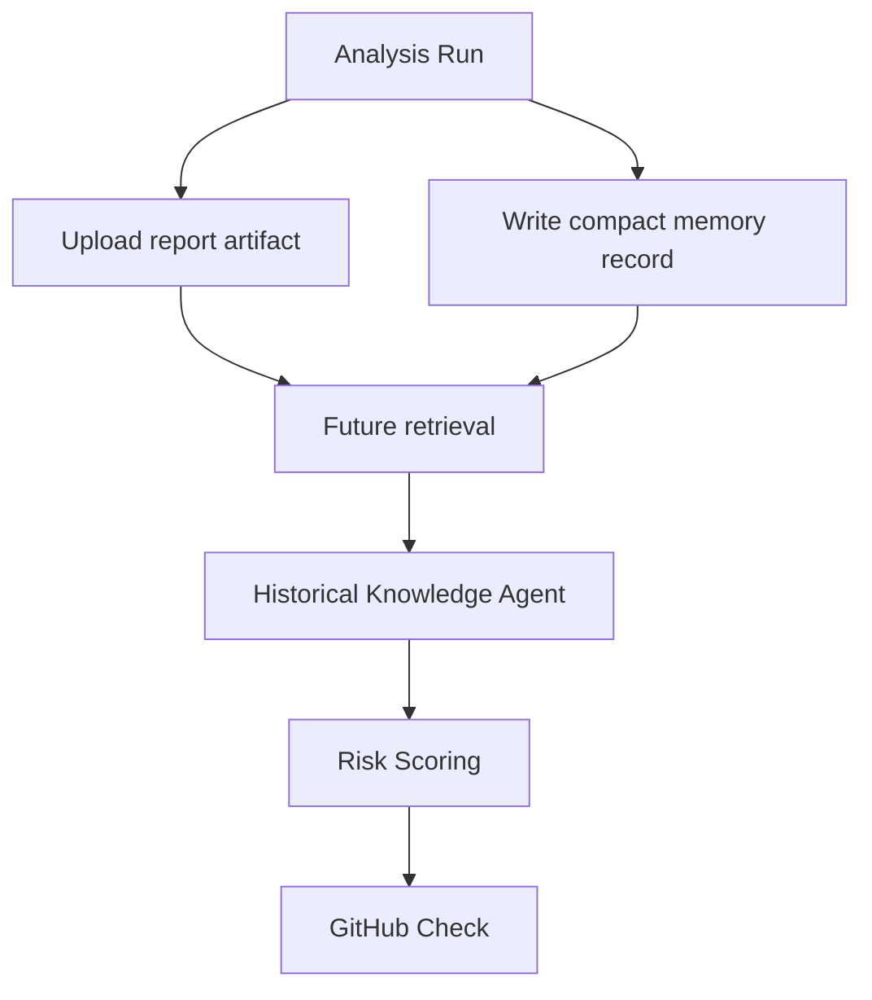

# Phase 5: Memory And Historical Learning

## Objective

Add historical engineering memory while preserving the GitHub Actions-only MVP architecture.

## Memory Sources

- Previous CodeGuardian report artifacts.
- Previous PR comments.
- CI failures.
- GitHub issues labeled incident or postmortem.
- Architecture decision records in the repository.
- CODEOWNERS and policy history.

## GitHub-Native Memory Options

| Storage | Use |
| --- | --- |
| Workflow artifacts | Store per-run report JSON and Markdown |
| Repository branch | Store compact memory records |
| GitHub issues | Store incidents and decisions |
| Pull request comments | Conversation history |

## Memory Flow



## Memory Record

```text
memory_record
- pr_number
- head_sha
- merged
- risk_score
- risk_level
- finding_categories
- affected_paths
- recommended_tests
- blocking_findings
- user_suppressions
- outcome_notes
```

## Senior Developer Prompt

```text
You are implementing Phase 5 memory for CodeGuardian AI.

Context loading:
- Read CONTEXT-GRAPH.md first.
- Then open only ROOT, PLAN, P5, and P3 unless the graph points you elsewhere.

Build GitHub-native memory without requiring an external database.

Requirements:
- Upload report artifacts for every run.
- Load latest report for the current PR.
- Support compare between current and previous run.
- Optionally write compact memory records to a repository branch.
- Retrieve similar past records by path, category, and keywords.
- Use Hugging Face embeddings only if configured.
- Fall back to keyword and path matching.
- Never store secrets or large code chunks.

Output:
- Memory storage design
- Retrieval algorithm
- Retention rules
- Privacy safeguards
- Compare mode behavior
- Test cases
```

## Product Manager Prompt

```text
You are defining historical memory for CodeGuardian AI.

Decide how historical context should help developers inside GitHub PRs.

Define:
- What memory should be stored.
- What should never be stored.
- How similar past PRs should be shown.
- How incidents should be referenced.
- How long memory should be retained.
- How users can delete or ignore memory.

Return:
- Memory product spec
- User-facing examples
- Privacy policy rules
- Retention defaults
```

## User Prompt

```text
@codeguardian has this happened before?

Find similar previous risks in this repository.
Show similar PRs, previous outcome, and whether this PR matches the same pattern.
```

## Acceptance Criteria

- Previous run comparison works.
- Similarity retrieval works without embeddings.
- Embedding route works when configured.
- No secrets are stored in memory.
- Historical context appears only when useful.
- Memory can be disabled by policy.
