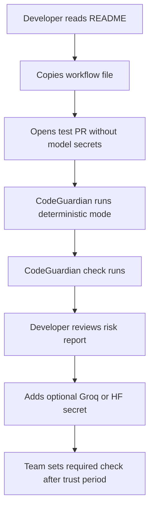

# Phase 6: Packaging And Adoption

## Objective

Package CodeGuardian as an easy-to-install GitHub Action and prepare it for developer adoption.

## Deliverables

- Reusable GitHub Action metadata.
- Example workflow file.
- Starter `.codeguardian/policy.yml`.
- Setup guide.
- Troubleshooting guide.
- Example PR outputs.
- Release and versioning process.
- Marketplace-ready documentation.

## Adoption Flow



## Default Configuration

Recommended default:

```text
mode: advisory
comment_on_low_risk: false
max_findings_in_comment: 5
max_findings_in_check: 3
inline_comments: false
skip_comment_for_docs_only: true
deterministic_fallback: true
model_provider_priority:
  - groq
  - huggingface
  - deterministic
```

## Senior Developer Prompt

```text
You are packaging CodeGuardian AI as a reusable GitHub Action.

Context loading:
- Read CONTEXT-GRAPH.md first.
- Then open only ROOT, PLAN, P6, and P1 unless the graph points you elsewhere.

Requirements:
- Provide action metadata.
- Provide a minimal workflow example.
- Provide a starter policy file.
- Support Groq, Hugging Face, and deterministic mode.
- Publish GitHub Checks and sticky PR comments.
- Upload report artifacts.
- Default to advisory mode and non-noisy comments.
- Include examples for public and private repos.
- Create release versioning rules.
- Add integration tests with fixture PR diffs.

Output:
- Packaging plan
- File structure
- Release process
- Example workflow
- Configuration reference
- Test and validation plan
```

## Product Manager Prompt

```text
You are preparing CodeGuardian AI for developer adoption.

Create the launch and onboarding plan.

Include:
- One-minute product explanation.
- Install steps.
- First successful run criteria.
- Recommended default settings.
- How to make the check required.
- How to configure Groq and Hugging Face.
- Common troubleshooting issues.
- Activation metrics.
```

## User Prompt

```text
I want to install CodeGuardian on this repository.

Give me:
- The workflow file to add.
- The secrets I need.
- The recommended default policy.
- How to open a test PR.
- How to make CodeGuardian a required check.
```

## Acceptance Criteria

- A new user can install in under 10 minutes.
- The first PR produces a check.
- No model key is required for first run.
- The default first run is advisory and does not block merges.
- Docs explain Groq and Hugging Face setup.
- Docs explain the suggested rollout from advisory to guarded to strict.
- Required-check setup is documented.
- Releases are versioned and changelogged.
