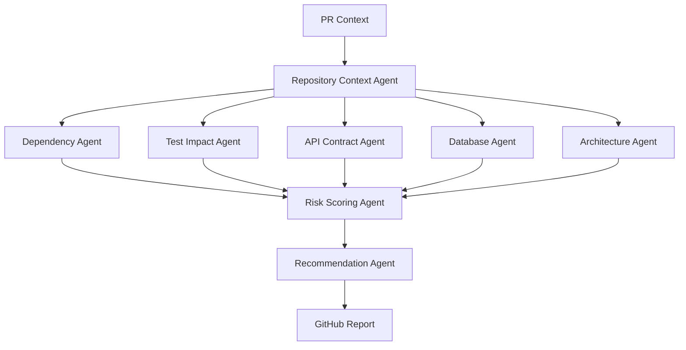
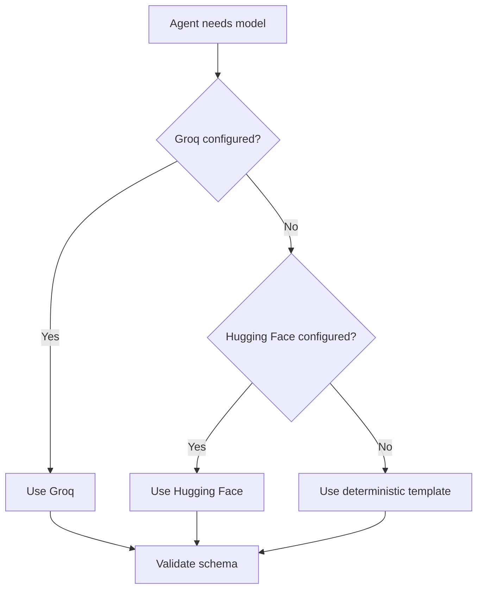

# Phase 2: LangGraph Agentic AI

## Objective

Introduce LangGraph as the orchestrator for structured, evidence-based, multi-agent PR analysis.

## Principle

Agents should not invent findings. Deterministic analyzers gather evidence first. LLM agents summarize, classify, compare, and recommend based on that evidence.

## Agent Graph



## LangGraph State

```text
CodeGuardianState
- pr_context
- diff_context
- repository_context
- static_evidence
- agent_findings
- risk_score
- report
- provider_usage
- errors
```

## Model Provider Routing



## Agent Output Rules

- Every finding must cite evidence.
- Every confidence score must be numeric.
- Every blocking decision must map to policy.
- Every model response must validate against schema.
- Any invalid model response falls back to deterministic output.
- PR comments must not expose raw prompt text or secrets.

## Senior Developer Prompt

```text
You are implementing Phase 2 of CodeGuardian AI.

Build a LangGraph workflow with these nodes:
- collect_pr_context
- repository_context
- dependency_agent
- test_impact_agent
- api_contract_agent
- database_agent
- architecture_agent
- risk_scoring_agent
- recommendation_agent
- publish_report

Requirements:
- Use typed shared state.
- Validate every node output.
- Route LLM calls through Groq, Hugging Face, or deterministic fallback.
- Do not allow LLM-only findings.
- Preserve evidence for every risk.
- Return GitHub-ready Markdown and JSON.

Output:
1. Graph design.
2. State schema.
3. Node contracts.
4. Provider router design.
5. Validation strategy.
6. Failure handling.
7. Test plan.
```

## Product Manager Prompt

```text
You are validating the agentic CodeGuardian workflow.

Review whether each agent contributes useful PR feedback.

Check:
1. Is each agent's responsibility clear?
2. Does every finding include evidence?
3. Is uncertainty communicated honestly?
4. Is the final PR output concise?
5. Is the merge recommendation easy to understand?

Return:
- Agent quality review
- Missing agent behavior
- Copy improvements
- Risk of hallucination
- Approval or changes required
```

## User Prompt

```text
@codeguardian what evidence supports this?

For each blocking finding, show:
- Evidence files
- Why the finding matters
- Confidence level
- Recommended fix
```

## Acceptance Criteria

- LangGraph controls the analysis pipeline.
- Provider fallback works.
- Invalid model output does not break the workflow.
- The final check summary is generated from structured state.
- Every high-risk finding has evidence.
- Deterministic mode remains available.

